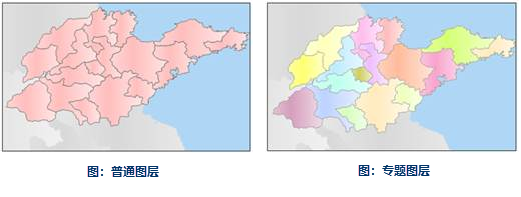
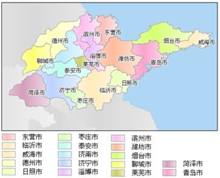
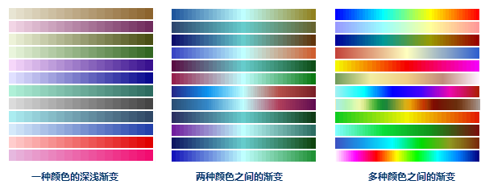

提供针对矢量数据及栅格数据制作专题图的功能，支持的专题图类型如下：

  * **单值专题图** ：是将专题值相同的要素归为一类，为每一类设定一种渲染风格，如颜色或符号等，专题值相同的要素采用相同的渲染风格，从而区分不同的类别。
  * **分段专题图** ：专题值按照某种分段方式被分成多个范围段，要素根据各自的专题值被分配到其中一个范围段中，在同一个范围段中的要素使用相同的颜色或符号风格进行显示。
  * **标签专题图** ：主要用于在地图上做标注，即用专题值对点、线、面等对象做标注，如标注景区名称等信息。
  * **统计专题图** ：为每个要素绘制统计图来反映其对应的专题值的大小。
  * **等级符号专题图** ：根据要素的某个数量特征，按照一定的分类方法用一组等级符号表示在地图上，以呈现要素间该数量特征的相对关系。
  * **点密度专题图** ：用一定大小、形状相同的点表示现象分布范围、数量特征和分布密度。点的多少和所代表的意义由地图的内容确定。点的个数越多越密集，则反映数据所表示的事物或现象在该区域的密度或浓度越大。
  * **自定义专题图** ：通过自定义属性字段来创建自定义专题图，根据数值型字段值与符号库中对应ID号的风格来设置显示风格，可以更自由的表达数据信息。
  * **栅格分段专题图** ：栅格数据集中像元的属性值被分成多个范围段，单元格值在同一个范围段中的像元使用相同的颜色进行显示。
  * **栅格单值专题图** ：栅格数据集中属性值相同的单元格归为一类，每一类设定一种颜色，从而区分不同的类别。

## 1.关于专题变量和专题值

专题变量是用来制作专题图的字段表达式，对矢量数据来说，该字段表达式可以是单字段，也可以是单个或多个字段构成的数学表达式。例如， Pop_2006 为
2006 年的人口数字段， Area 为各城市的面积字段，那么在制作分段专题图时，可以用表达式： Pop_2006/Area 来做该专题图的专题变量。

专题图可以表达一个或多个专题变量的信息，通常单值专题图，分段专题图，点密度专题图，等级符号专题图以及标签专题图的创建都是基于一个专题变量；而统计专题图则可以基于多个专题变量，例如你可以将人口数量和城市的面积在一个饼状统计专题图中显示。特别说明，一个专题变量可以通过字段表达式的形式表示多个属性字段的内容。

专题变量对应的值，称为专题值。专题值可以为数值型数据，也可以为非数值型数据（如土地利用的类型，房屋所有者等）。非数值型数据一般用来制作单值专题图或标签专题图；数值型数据可以用来制作各种类型的专题图。

对于栅格数据，专题变量是栅格数据集中的像元，即专题值为栅格数据集中像元的属性值。

## 2.关于图层、普通图层与专题图层

当数据集被加载到地图窗口中显示时，就形成了一个图层，图层是数据集的可视化显示。按照显示风格，图层可以分为普通图层和专题图层。普通图层使用单一的风格来渲染图层，专题图层则是基于专题变量，采用专题风格来渲染。

 
  
一个数据集可以对应多个专题图，下图是对山东省数据根据城市名称制作的标签专题图和单值专题图，并将其同时显示在了一个地图窗口中。

在浏览图层时提供了随图缩放的功能，即在对图层进行放大或缩小操作时，要素的符号风格的大小会随之进行放大或缩小，比如，当用户选择了随图缩放功能后，对标签专题图进行放大操作，此时标签也会随之放大。

**注意** ：设置随图缩放的方法只对有大小的符号或字体以及有粗细的线型等风格有效，对颜色等风格不起作用。

  

  
## 3.关于专题图子项

很多类型的专题图都有专题图子项的概念，而对于不同类型的专题图对应的专题图子项所具有的含义不同。目前，有专题图子项的专题图类型包括：单值专题图，统计专题图，分段专题图，标签专题图，栅格分段专题图，栅格单值专题图。一个子项内包含的要素视为一个整体，对该子项进行风格设置时，子项内的要素均会发生改变。

  * **单值专题图** 是将专题值相同的要素归为一类，为每一类设定一种渲染风格，其中每一类就是一个专题图子项。比如，利用单值专题图制作行政区划图，Name 字段代表省/直辖市名，该字段用来做专题变量，如果该字段的字段值总共有 5 种不同值，则该行政区划图有 5 个专题图子项，其中每一个子项内的要素 Name 字段值都相同。
  * **分段专题图** 是将专题值按照某种分段方式分成多个范围段，要素根据其所对应的专题值被分配到其中一个分段中，在同一个范围段中的要素使用相同的颜色，填充，符号等风格进行显示，其中每一个范围段就是一个分段专题图子项。
  * **标签专题图** 用专题值对点、线、面等对象做标注，值得注意的是，标签专题图允许用户设置范围段，同一范围段内的标签具有相同的显示风格，其中每一个范围段就是一个专题图子项。
  * **统计专题图** 可以将多个专题值绘制在一个统计图上，从而一次对多个数值型变量进行分析统计。专题图子项的个数就是专题图中专题变量的个数。比如，一幅城乡人口比例图（三维柱状图），该图有两个专题变量，一个专题变量为字段城镇人口（代表城镇人口数量），另一个专题变量为字段农村人口（代表农村人口数量）。则该统计专题图的专题图子项有两个，分别为东北三省城镇人口字段的值所对应的统计图和农村人口字段的值所对应的统计图。
  * **栅格分段专题图** 类似于分段专题图，不同在于分段专题图的操作对象是矢量数据，而栅格分段专题图的操作对象是栅格数据，相应地，栅格分段专题图子项就是按照某种分段方式分成的不同的范围段。
  * **栅格单值专题图** 是将属性值相同的像元归为一类，每一类是一个专题图子项。

## 4.关于显示过滤

在制作专题图时，显示过滤功能可以按照用户设置的过滤条件，有选择性地显示一些要素，以便重点分析感兴趣的要素。用户可以通过标准的 SQL
表达式来设置过滤条件，不满足条件的要素将被过滤掉。例如在用等级符号专题图显示某大型超市的各连锁店的销售额时，则使用 SQL 表达式：
[(Sales_06-Sales_05)/Sales_05]<10% 作为过滤条件，则销售额的年增长率大于等于 10% 的连锁店将不会在结果专题图中显示。

## 5.关于颜色方案

对有专题图子项的专题图类型，SuperMap
提供了一套颜色方案，它可以为专题图的所有专题图子项的颜色渲染提供一个配色方案，同时会根据专题图子项的个数来合理分配给每一个子项一个渲染颜色。

系统预定的颜色方案有三种类型如表 2.1，它们是一种颜色的深浅的渐变；两种颜色之间的渐变；多种颜色之间的渐变。

   

  
## 6.关于专题风格的导入与导出

在  中，专题图的风格设置可以导出成 *.xml 格式的文件，用户通 XML 文件可以方便地查看和修改专题图的风格设置信息。

XML 文件记录了有关专题图的所有设置信息，比如，标签专题图的 *.xml
格式文件会记录专题图类型、可见比例尺、标签风格的设置等对该标签专题图的所有风格设置，以及用来制作标签专题图的专题变量。

专题风格的 *.xml 文件在导入时，需要注意：首先，必须应用于同种类型的专题图，如标签专题图导出的 *.xml 只可以应用到标签专题图上；其次，XML
文件中除风格的设置外，还有关于专题变量等的设置，除非导入该 *.xml 文件的专题图引用的数据与导出该 *.xml
文件的专题图引用的数据相同，否则，对这些不一致的信息，需要加以修改，才能应用。

