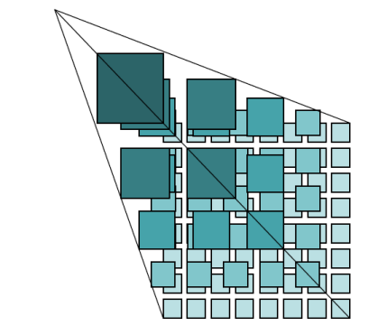
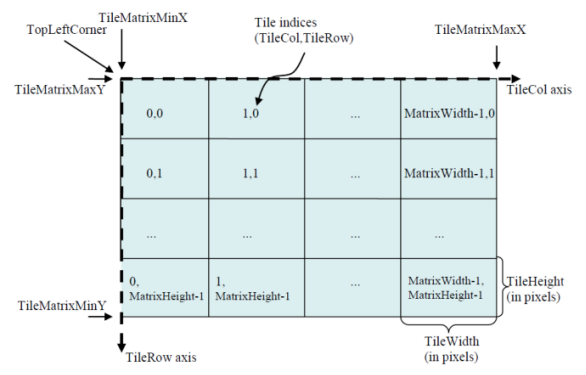

Web 引擎可以直接访问 WFS、WMS、WCS、REST 以及其他地图服务商所提供的服务，这类引擎就是把网络上符合行业标准的 Web 服务器，作为
SuperMap 的数据源来处理，通过它可以把网络发布的地图和数据与 SuperMap 的地图和数据完全结合，将应用融入到 SuperMap
的技术体系，拓展了 SuperMap 数据引擎的应用领域。Web 数据源为只读引擎。

桌面产品支持以下几种 Web 型数据源:

  1. OGC 标准服务（W*S）

  2. REST 服务

  3. 谷歌地图服务（GoogleMaps）

  4. 天地图服务（MapWorld）

  5. OpenStreetMap

  6. 全球地形图服务

  7. 服务示例

### OGC 标准服务（W*C）

**OGC 概念理解**

  * **GML** ：Geography Markup Language，OGC 的地理标记语言，其模型使用 OGC 的简单对象模型，基于 XML 语法和文件格式组织文件。
  * **URI** ：用资源标识符进行定位。利用桌面客户端打开 OGC 服务，需要输入请求体的地址，即 URI 。一般由三部分组成：访问资源的命名机制，存放资源的主机名。资源自身的名称，由路径表示。路径结构为：http://<server>:<port>/iserver/services。其中： 
    * server：发布服务的服务器地址。
    * port：发布服务的端口号。
    * servicecomponent：已配置的服务组件或服务组件集合的名称，比如，SuperMap iServer 默认配置了地图服务组件 map-world。
    * serviceinterface：已配置的并被服务组件绑定的服务接口名称，比如，SuperMap iServer 默认配置了 WMS 1.1.1 版本的服务接口，其服务接口名称为 wms111。
  * **版本协商** :Version Number Negotiation，OGC 网络服务标准的版本有高低之分，并用数字标识。一般来说客户端和服务器之间实现或支持的版本经常是不同的，版本协商制定了如何达到客户端和服务器之间版本同步的规则。规则如下： 
    1. 如果服务器实现了客户端请求的版本号，那么服务器必须发送该版本的数据。
    2. 如果客户端发送的请求是服务器不识别的高版本，那么服务器必须发送低于请求版本的最高版本。
    3. 如果客户端请求了一个比服务器支持的所有版本都要低的版本，那么服务器必须发送它所支持的最低版本。
    4. 如果客户端不认识服务器返回的版本，它将停止与服务器的通讯，同时向服务器请求一个低于服务器返回版本且客户端可识别的版本。
    5. 假如客户端请求的版本比所有服务器支持的版本都要低，根据规则3服务器响应了一个服务器的最低版本，但客户端仍不识别此高版本，那么客户端将发送一个高于服务器响应版本的请求。
    6. 版本协商过程将重复不断进行，直到达成双方一致的版本，或者客户端认为已经无法与特定的服务器交互。

**OGC 服务介绍**

  * **WMS 服务**

WMS（Web Map Service），即 Web 地图服务，该服务符合 OGC（Open Geospatial
Consortium，开放地理信息联盟）制定的 WMS
实现规范。此标准主要定义了用于创建和显示地图的三大操作：GetCapabilities（获取服务能力）, GetMap（获取地图）和
GetFeatureInfo（获取对象信息）。该标准主要定义了用于创建和显示地图的三大操作，包括：

  1. GetCapabilities，该操作用于获取服务级元数据。该操作是必需的。
  2. GetMap，核心操作，该操作用于获取地理空间参数和大小已明确定义的地图图像。该操作是必需的。
  3. GetFeatureInfo，该操作用于获取显示在地图上的某些特殊要素（feature）的信息。该操作可选择。

目前  桌面支持打开以下 WMS 版本:  
    
  * WMS 1.1.1
  * WMS 1.3.0  

  * **WFS 服务**

WFS(Web Feature Service)：Web 要素服务，该服务符合 OGC（Open Geospatial
Consortium，开放地理信息联盟）制定的 WFS 实现规范。此标准主要用来返回要素级的 GML 编码。WFS 允许客户端从多个网络要素服务中取得使用
GML 编码的地理空间数据。不同的 WFS 客户端支持的字符集不一，因此发送请求时，请求体的编码类型也不一致。

### 备注

目前 WFS 数据源仅支持数据浏览功能。

  * **WCS**

WCS（Web Coverage Service，Web 覆盖服务）服务，该服务符合 OGC（Open Geospatial
Consortium，开放地理信息联盟）制定的 WCS 实现规范。

WCS 是 OGC 定义的在 Web
上以“Coverage”的形式共享地理空间数据的规范。所谓“Coverage”是指能够返回任意指定点的值的数据，其形式易于输入到模型中使用。WCS
服务是以“Coverage”的形式实现了栅格影像数据集的共享。

目前  桌面支持打开 WCS 1.0.0版本的数据。

  * **WMTS**
    1. WMTS 的提出

WMS
地图服务可以灵活响应各种请求，客户端每发出一个请求，服务端都实时对数据进行可视化，然后以图片的方式返回结果，但是访问量大的情况下，频繁的请求需要占用大量资源用于计算，导致响应能力下降。为了提供地图服务的相应能力，需要减少服务端可视化处理的时间，因此出现了以缓存方式提高行相应能力的服务，WMTS
就是一种。

    2. WMTS 的概念

WMTS，Web 地图瓦片服务（Web Map Tile Service），该服务符合 OGC 指定的 WMTS 规范。 WMTS
标准定义了一些操作，这些操作允许用户访问瓦片地图，是 OGC 首个支持 REST 访问的服务标准。

WMTS 是 OGC
提出的缓存技术标准，提供了一种采用预定义瓦片的方式发布地图服务的标准化方案。在服务器端缓存被切割成一定大小瓦片的地图，对客户端只提供这些预先定义好的单个瓦片的服务，将更多的数据处理操作如图层叠加等放在客户端，从而缓解
GIS 服务器端数据处理的压力，改善用户体验。

WMTS 使用瓦片矩阵集（Tile matrix
set）来表示切割后的地图，如图1所示。瓦片就是包含地理数据的矩阵单元。一幅地图按一定的瓦片大小被切割成多个瓦片，形成瓦片矩阵（Tile
matrix）。一个或多个瓦片矩阵即组成瓦片矩阵集。不同的瓦片矩阵具有不同的比例尺，每个瓦片矩阵由瓦片矩阵标识符（一般为瓦片矩阵的序号，分辨率最低的一层为第0层，依次向上排）进行标识。WMTS规定每个图层可以指定多个瓦片矩阵集，每一个瓦片矩阵集有自己的坐标参照系统，瓦片矩阵集中的各个瓦片矩阵则对应各级比例尺。

  

  
每个瓦片矩阵具有如下特点：

  * 以自己的瓦片尺寸作为比例尺。
  * 通过像素来定义的每个瓦片的宽（TileWidth）和高（TileHeight），即瓦片的大小。
  * 矩阵边界框的左上角坐标（TileMatrixminX，TileMatrixmaxY）。
  * 以瓦片为单位来定义的矩阵的宽（MatrixWidth）和高（MatrixHeight），如瓦片数。

瓦片矩阵中的每个瓦片由瓦片的行号（TileRow）和列号（TileCol）进行标识，行列值分别从瓦片矩阵左上角点所在的瓦片开始算起，起始行列值是（0，0），依次向下向右增加，如图2所示。

  

  3. WMTS 的实现模型

WMTS 1.0.0 支持三种实现模型：

  * HTTP KVP（Key-Value Pair）方式
  * SOAP 方式
  * REST 方式

目前提供了 KVP、REST 两种方式的实现。

WMTS 从服务端请求的资源，即可以面向过程的架构风格，也可以使面向资源的架构风格。从面向过程的概念来讲，WMTS 1.0.0定义了
GetCapabilities、GetTile、GetFeatureInfo 三个操作，其中 GetFeatureInfo
是可选操作。从面向资源的概念来讲，WMTS 1.0.0 定义了
ServiceMetadata（服务原数据）、Tile（瓦片数据）、FeatureInfo（要素信息）三种资源，分别与
GetCapabilities、GetTile、GetFeatureInfo 操作相对应。

  1. GetCapabilities，返回服务元数据（ServiceMetadata），即服务能力和信息内容。
  2. GetTile，返回瓦片地图（Tile）。
  3. GetFeatureInfo，返回显示在瓦片地图上的要素信息（FeatureInfo），是可选操作。

更多有关 OGC 服务的内容请参考:OGC（Open Geospatial
Consortium，开放地理信息联盟）相关规范，<http://www.opengeospatial.org>。

### REST 服务

REST-表述性状态转移（Representational State Transfer）是 Roy Fielding
博士在2000年提出来的一种软件架构风格。采用 REST 架构风格的 Web 服务相比复制的 SOAP 服务更加简洁、易用。SuperMap 的 REST
服务是专门为 GIS 的用户提供了 REST 风格的 GIS 服务。

REST 强调从资源的角度来观察整个网络，基于 REST 的架构是一种面向资源的结构（Resource-Oriented
Architecture，ROA）。资源可以是具体的数据，也可以是能够实现某些功能的服务，客户端的应用通过 URI（Uniform Resource
Identifier，统一资源标识符）唯一标识，客户端的应用通过URI来获取资源的表述，获得这些表述使客户端应用程序转变了状态，即表述性的状态转变。

REST 通常使用 HTTP，URI，XML 以及 HTML 这些现有的广泛流行的协议和标准。SuperMap UGC REST 服务具有以下特点：

  1. 服务器提供的每项资源都通过 URI 进行唯一标识，但一个资源可以被多个 URI 标识。
  2. REST 服务使用 HTTP 协议标准的方法，包括：GET、POST、PUT、DELETE 方法等，分别对应对资源的四种操作，获取、创建、修改和删除等。
  3. 对资源提供多种格式的表述，如 xml，json，html 等。
  4. REST 服务处理资源请求所需的全部信息均包含在请求内。

### 谷歌地图服务（GoogleMaps）

针对谷歌电子地图服务，只读，不能创建。

谷歌地图（GoogleMaps）是 Google 公司提供的电子地图服务，包括矢量地图，不同分辨率的遥感影像，以及一些地形数据。 桌面集成
GoogleMaps 引擎，在网络连通的情况，可以在桌面产品中直接访问谷歌地图服务。目前支持访问以下几种地图类型：

  * **roadmap** ：标准路线图，如 Google Maps 地图网站所示的普通地图。
  * **satellite** ：卫星影像图层。
  * **terrain** ：地图地图，用来显示地形和植被。
  * **hybrid** :包含卫星影像和路线图的混合图层，在卫星图片上显示主要的街道和地址名称的透明图层。

谷歌地图网站：<http://maps.google.com>

**注意**：目前默认服务地址http://maps.google.com在中国地区内可能无法正常显示地图，打开后地图会空白显示，但国外用户可以正常使用该功能。

      对于中国地区用户，可以将服务地址切换为http://www.google.cn/maps后，再次尝试访问地图。

### 天地图服务（MapWorld）

针对天地图发布的地图服务。只读，不能创建。

天地图服务是国家测绘局为公众提供权威、可信、统一的地理信息服务，是目前中国区域内数据资源最全的地理信息服务网站。天地图网站提供了海量基础地理信息资源，包括全球范围的矢量地形服务和遥感影像、全国范围的地图数据，导航电子地图数据，部分城市三维街景数据。
桌面集成了天地图引擎，在网络连通的情况下，可以在桌面产品中直接访问天地图服务。目前支持的图层类型包括：

* **BackgroundMap** :背景图层，可以作为底图使用。
* **AnnoMap** ：中文注记图层。
* **AnnoMapE** ：英文注记图层。
* **Terrain** ：地形图层 ，坐标系统为 WGS_1984，可直接加载到场景中使用。

天地图网站：[www.tianditu.cn](http://www.tianditu.cn)

### OpenStreetMap（OSM）

OpenStreetMap(简称 OSM），是一个可供自由编辑的世界地图。OSM 是一个网上地图协作计划，目标是创造一个内容自由且能让所有人编辑的世界地图。

OSM 地图数据以开放数据库授权方式授权。数据可以免费下载，并依据开放许可协议使用。注册用户可以将手持 GPS
设备、航空相片、卫星影像等自由内容上传或者对地图的矢量数据进行编辑。

目前支持以下图层类型： **Standard** 、 **Cycle Map** 、 **Transport Map**  和  **MapQuest Open** 。

OpenStreetMap 网站：[www.openstreetmap.org](http://www.openstreetmap.org)

### 全球地形图服务

全球地形图服务可分为基础地形图服务和深色地形图服务两类，是通过栅格瓦片格式提供的全球晕渲图，基于全球 DEM
制作的全球晕渲图使用阴影与颜色渐变来展现全球地表的起伏变化，同时叠加了植被、城镇、冰川、以及荒原等数据，方便用户直接使用此图作为底图来展示特定的专题要素。

地形图服务分为十个显示比例尺，为使地形显示效果更好，每个显示比例尺使用了不同分辨率地形数据，由分辨率为1800m的DEM重采样得到。

其中基础地形图为全球浅色系地形图数据；深色地形图为全球蓝黑色系地形图数据。可通过以下地址在浏览器中查看该数据：

基础地形图：<https://maptiles.supermapol.com/iserver/services/map-
Hillshade/rest/maps/WorldTerrainBase>

深色地形图：<https://maptiles.supermapol.com/iserver/services/map-
Hillshade/rest/maps/WorldTerrainBlueDark>

### 服务示例

感兴趣的用户可以访问以下地址，体验 iServer 服务器提供的一些服务。

  * WMS 服务： 

<http://support.supermap.com.cn:8090/iserver/services/map-
china400/wms111/China>

<http://support.supermap.com.cn:8090/iserver/services/map-world/wms130/World>

  * WFS 服务： 

<http://support.supermap.com.cn:8090/iserver/services/data-world/wfs100>

  * REST 服务: 

<http://support.supermap.com.cn:8090/iserver/services/map-
china400/rest/maps/China>

