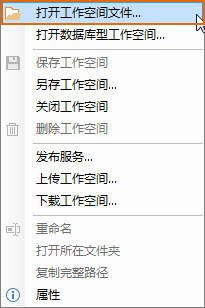

下面对工作空间管理器中的工作空间结点的右键菜单进行定制，例如：修改该右键菜单中的“打开文件型工作空间...”这个菜单项（按钮控件）的显示名称为“打开工作空间文件”。

  1. 在工作环境设计窗口的结构区中找到并选中工作空间管理器中的工作空间结点的右键菜单所对应的结点。
  2. 在属性浏览设置区，修改右键菜单中“打开文件型工作空间...”按钮控件的显示名称，属性“标签”用来设置显示名称，将该属性值修改为“打开工作空间文件”。
  3. 如果确定保存修改的结果，单击工作环境设计窗口中的“确定”按钮，关闭工作环境设计窗口并应用修改的设。
  4. 此时，右键单击工作空间管理中的工作空间结点，弹出右键菜单，就可以看到定制后的效果。  
  
  
