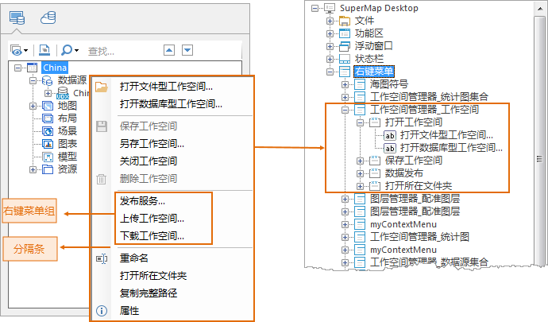

工作环境设计窗口的结构区中，根结点下的显示名称为“右键菜单”的结点，其子结点对应着应用程序所提供的所有可定制的右键菜单，应用程序的右键菜单主要分布在工作空间管理器、地图窗口、图层管理器、场景窗口等。

  1. **右键菜单结点说明**

工作环境设计窗口的结构区中，“右键菜单”结点的子结点，每个子结点对应一个右键菜单，工作环境设计窗口中是显示和设置应用程序的右键菜单，
而在应用程序中具体由哪个用户操作条件来弹出哪个右键菜单，是通过程序来识别和调用的，因此，这就需要每个右键菜单都有自己的标识，
应用程序提供了一些接口，用来标识各个右键菜单，在结构区中，每个右键菜单结点的显示名称即为标识该右键菜单的接口，
例如：显示名称为SuperMap.UI.WorkspaceManager. ContextMenuWorkspace
结点，该名称中SuperMap.UI.WorkspaceManager 标识右键菜单 所绑定的窗口，表示该右键菜单与工作空间管理器窗口绑定，名称中
ContextMenuWorkspace 标识右键菜单具体绑定了工作空间管理器中
哪种类型的结点，这里表示右键菜单与工作空间管理器中的工作空间结点绑定，因此，当在应用程序的工作空间管理器中右键点击工作 空间结点，将弹出
SuperMap.UI.WorkspaceManager. 结点所对应的右键菜单。

工作环境设计窗口的结构区中，右键菜单结点的显示名称分为两部分（以显示名称：SuperMap.UI.WorkspaceManager.
ContextMenuWorkspace为例说明）， 类似于[SuperMap.UI.WorkspaceManage]
这部分标识右键菜单绑定的窗口对应的类；类似于[ContextMenuWorkspace] 这部分标识该窗口中具体位置 或者具体弹出条件的右键菜单。

  2. **右键菜单结点下的结点结构说明**

如下图所示，以应用程序的工作空间管理器中的工作空间结点的右键菜单为例，来说明右键菜单的结构，右键菜单包含了右键菜单项，
右键菜单可以使用分隔条对右键菜单中的菜单项进行分组，这种分组称为右键菜单组。

  

  
在工作环境设计窗口的结构区中，右键菜单结点的每个子结点一一对应着右键菜单组，右键菜单组结点的每个子结点一一对应着该组中的菜单项（控件）。

结构区中对应右键菜单上的界面元素（菜单项）的结点，其结点的显示名称为该界面元素在界面上所显示的名称。
