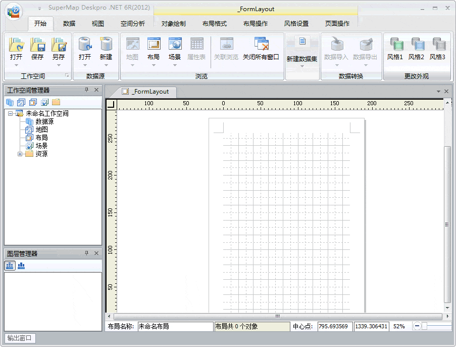

### 使用说明

为二次开发用户提供了风格样式接口及接口文档，用户在扩展开发时候可以根据自身需求选择使用本文中介绍的更换主题外观方法。

下面我们会举例介绍三种更换桌面风格的方式。

  
  
  
  1. **大海绿** 风格使用接口程序传递参数方式实现主题设计外观更换。该方法适合能熟练进行扩展开发的用户，灵活调用各个应用程序外观属性的接口，自定义其外观颜色和文本风格。
  * 参照前边介绍的[二次开发](../../GettingStarted\\Develop_index)文档建立 DeskproThemeStlyeTest 工程,在工程中添加上对于SuperMap.Desktop.UI， System.Drawing和 System.IO 等 .dll 文件的引用。
  * 建立 _CtrlActionSeaGreen 工程文件用于实现 **大海绿** 风格的程序填写,（Using）添加SuperMap.Desktop.UI； System.Drawing ；的引用。
  * 在 _CtrlActionSeaGreen 类中重写 Run()方法。 Run() 方法是用来响应控件事件，本例中实现的功能为：使用 已开放的 ThemeStlye 类中的成员属性进行参数传递实现桌面风格的更换。在 _CtrlActionSeaGreen.cs 文件中，将 Run() 方法中的代码重写为如下实现代码：

```       
                     
                  {    
                        //构造 ThemeStyle 风格对象。
                        ThemeStyle themeStyleTest = new ThemeStyle();
                        
                        //设置 Ribbon 风格。
                        UIRibbonThemeStyle ribbonThemeStyle = new UIRibbonThemeStyle();
        
                        ribbonThemeStyle.Font = new Font("微软雅黑", 9);
                        ribbonThemeStyle.ForeColorLight = Color.Black;
                        ribbonThemeStyle.ForeColorDark = Color.DarkSlateGray;
                        ribbonThemeStyle.BackColor = Color.SeaGreen;
                        ribbonThemeStyle.TitleFont = new Font("微软雅黑", 9);
                        // 设置 RibbonTab 风格。
                        ribbonThemeStyle.RibbonTabStyle = new UIRibbonTabThemeStyle();
                        ribbonThemeStyle.RibbonTabStyle.ForeColor = Color.Black;
                        ribbonThemeStyle.RibbonTabStyle.FontUnderline = true;
                        ribbonThemeStyle.RibbonTabStyle.FontItalic = false;
                        ribbonThemeStyle.RibbonTabStyle.FontBold = false;
                        ribbonThemeStyle.RibbonTabStyle.FontStrikeout = false;
        
                        // 把 ribbonThemeStyle 风格应用到 ThemeStyle 风格对象的 Ribbon 属性。
                        themeStyleTest.RibbonStyle = ribbonThemeStyle;
        
                        //设置可活动管理窗口风格。
                        UIPanelThemeStyle Panl = new UIPanelThemeStyle();
                        Panl.CaptionStyle = new UICaptionThemeStyle();
                        Panl.CaptionStyle.ForeColor = Color.Black;
                        Panl.CaptionStyle.Font = new Font("微软雅黑", 9);
                        Panl.MainColor = Color.SeaGreen;
                      
        
                        //设置可活动管理窗口内部风格。
                        UIInnerThemeStyle innerThemeStyle = new UIInnerThemeStyle();
                        innerThemeStyle.BackColor = Color.SeaGreen;
                        innerThemeStyle.BackColorGradient = Color.LightPink;
                        innerThemeStyle.BackgroundGradientMode = BackgroundGradientMode.Vertical;
                        
                        innerThemeStyle.BackgroundImageDrawMode = BackgroundImageDrawMode.Stretch;
                        innerThemeStyle.Blend = 0.5f;
                        innerThemeStyle.BlendGradient = 0.5f;
                        innerThemeStyle.Font = new Font("微软雅黑", 9);
                        innerThemeStyle.ForeColor = Color.Black;
                        innerThemeStyle.Opacity = 50;
        
                        //把 innerThemeStyle 风格应用给 Panel 风格对象的 InnerArea 属性。
                        Panl.InnerAreaStyle = innerThemeStyle;
                        //把活动窗口内部风格显示模式设置成自定义模式。
                        Panl.InnerAreaStyleType = InnerAreaStyleType.UseInnerStyle;
        
                        themeStyleTest.PanelStyle = Panl;
                        //创建窗体标签风格对象。
                        UITabThemeStyles windowTab = new UITabThemeStyles();
                        //设置窗体标签样式1。
                        UITabThemeStyle wTTStyle1 = new UITabThemeStyle();
                        wTTStyle1.BackColor = Color.Goldenrod;
                        wTTStyle1.BackColorGradient = Color.AliceBlue;
                        wTTStyle1.ForeColor = Color.Black;
                        wTTStyle1.Blend = 0.5f;
                        wTTStyle1.BlendGradient = 0.5f;
                        wTTStyle1.Font = new Font("微软雅黑", 9);
        
                        //设置窗体标签样式2。
                        UITabThemeStyle wTTStyle2 = new UITabThemeStyle();
                        wTTStyle2.BackColor = Color.Gray;
                        wTTStyle2.BackColorGradient = Color.White;
                        wTTStyle2.ForeColor = Color.LightGray;
                        wTTStyle2.Blend = 0.5f;
                        wTTStyle2.BlendGradient = 0.5f;
                        wTTStyle2.Font = new Font("微软雅黑", 9);
        
                        UITabThemeStyle wTTStyle3 = new UITabThemeStyle();
                        wTTStyle3.BackColor = Color.LightGoldenrodYellow;
                        wTTStyle3.BackColorGradient = Color.White;
                        wTTStyle3.ForeColor = Color.DarkGray;
                        wTTStyle3.Blend = 0.5f;
                        wTTStyle3.BlendGradient = 0.5f;
                        wTTStyle3.Font = new Font("微软雅黑", 9);
        
                        //为普通、选中、热门（鼠标滑过）、按下这四种状态分别附上风格样式1和风格样式2。
                        windowTab.Normal = wTTStyle2;
                        windowTab.Selected = wTTStyle1;
                        windowTab.Hot = wTTStyle3;
                        windowTab.Pressed = wTTStyle1;
        
                        //把窗口标签风格对象赋给 themeStyleTest.PanelStyle.TabStyle 属性。
                        themeStyleTest.PanelStyle.TabStyle = windowTab;    
        
                        //把 themeStyleTest 风格应用到 ThemeStyle 风格对象。
                        SuperMap.Desktop.Application.ActiveApplication.MainForm.ThemeStyle = themeStyleTest;
        
                
                  }
        		  
   ```     

* **注：** 只有当 UIPanelThemeStyle 派生对象的 InnerAreaStyleType 属性枚举值为 UseInnerStyle 时，UIInnerThemeStyle 派生对象的内部方法或属性才生效。
2. **宝石蓝** 风格使用接口程序 的 FromXML() 方法读取风格配置文件实现主题设计外观更换。该方法为用户在二次开发时提供了一个 .XML 文件记录主题风格，用户可以开发按钮控件通过配置和调用该文件进行风格切换。此方法难易程度和灵活度适中。
* 在已经建立的 DeskproThemeStlyeTest 工程中建立_CtrlActionBlue 工程文件用于实现 **宝石蓝** 风格程序填写，（Using）添加SuperMap.Desktop.UI；  
System.Drawing；和System.IO的引用。

* 在_CtrlActionBlue 类中重写 Run()方法。 本例中实现的功能为：使用 已开放的 ThemeStlye 类中的 FromXML() 方法实现桌面风格的更换。在_CtrlActionBlue.cs 文件中，将 Run() 方法中的代码重写为如下实现代码：

```                   
                 {     
                    //找到本地已经保存好的风格配置 xml 文件。
                    String directory = System.AppDomain.CurrentDomain.BaseDirectory;
                    String path = directory +@"Plugins\ThemeStyleDesign\themeStyle.xml"; ;
                    //读取内容将内容暂时保存在 xmlContent 中。
                    String xmlContent = File.ReadAllText(path);
                    //将得到的风格内容通过 FromXML（）方法传递给 ThemeStyle 风格对象。
                    SuperMap.Desktop.Application.ActiveApplication.MainForm.ThemeStyle.FromXML(xmlContent);
        
                    //刷新。
                    SuperMap.Desktop.Application.ActiveApplication.MainForm.RefreshThemeStyle();
                  }
        		  
        

themeStyle.xml

Copy

        
                <?xml version="1.0" encoding="utf-8"?>  
        
        <themestyle xmlns="http://www.supermap.com/desktop" author="" Version="">  
          
        
          <!--设置 Ribbon 风格-->  
        
          <ribbon>  
        
          <titleFont>  
        
          <fontFamily>宋体</fontFamily>  
        
          <size>9</size>  
        
          <fontStyle>Regular</fontStyle>  
        
          <graphicsUnit>Point</graphicsUnit>  
        
          <gdiCharSet>134</gdiCharSet>  
        
          <gdiVerticalFont>False</gdiVerticalFont>  
        
          </titleFont>  
        
          <backColor>#BFDBFF</backColor>  
        
          <foreColor>#000000</foreColor>  
        
          <foreColorDark>#1F497D</foreColorDark>  
        
          <foreColorLight>#1F497D</foreColorLight>  
        
          <font>  
        
          <fontFamily>微软雅黑</fontFamily>  
        
          <size>9</size>  
        
          <fontStyle>Regular</fontStyle>  
        
          <graphicsUnit>Point</graphicsUnit>  
        
          <gdiCharSet>134</gdiCharSet>  
        
          <gdiVerticalFont>False</gdiVerticalFont>  
        
          </font>  
        
          <!-- 设置 RibbonTab 风格-->  
        
          <ribbonTab>  
        
          <fontBold>False</fontBold>  
        
          <fontItalic>False</fontItalic>  
        
          <fontStrikeout>False</fontStrikeout>  
        
          <fontUnderline>False</fontUnderline>  
        
          <foreColor>#1D396D</foreColor>  
        
          </ribbonTab>  
        
          </ribbon>  
        
          <!--设置可活动管理窗口风格-->  
        
          <dockpanel>  
        
          <mainColor>#6DA5E2</mainColor>  
        
          <innerAreaStyleType>0</innerAreaStyleType>  
        
          <dockBarCaption>  
        
          <foreColor>#000000</foreColor>  
        
          </dockBarCaption>  
        
          <!--创建窗体标签风格-->  
        
          <windowsTab>  
        
          <normal>  
        
          <!--标签参数为空时取默认值。-->  
        
          <backColor> </backColor>  
        
          <backColorGradient> </backColorGradient>  
        
          <blend>-1</blend>  
        
          <blendGradient>-1</blendGradient>  
        
          <foreColor> </foreColor>  
        
          </normal>  
        
          <hot>  
        
          <backColor> </backColor>  
        
          <backColorGradient> </backColorGradient>  
        
          <blend>-1</blend>  
        
          <blendGradient>-1</blendGradient>  
        
          <foreColor> </foreColor>  
        
          </hot>  
        
          <pressed>  
        
          <backColor> </backColor>  
        
          <backColorGradient> </backColorGradient>  
        
          <blend>-1</blend>  
        
          <blendGradient>-1</blendGradient>  
        
          <foreColor> </foreColor>  
        
          </pressed>  
        
          <selected>  
        
          <backColor> </backColor>  
        
          <backColorGradient> </backColorGradient>  
        
          <blend>-1</blend>  
        
          <blendGradient>-1</blendGradient>  
        
          <foreColor> </foreColor>  
        
          </selected>  
        
          </windowsTab>  
        
          <!--设置可活动管理窗口内部风格。-->  
        
          <innerStyle>  
        
          <backColor>#FFFFFF</backColor>  
        
          <foreColor>#000000</foreColor>  
        
          <font>  
        
          <fontFamily>宋体</fontFamily>  
        
          <size>9</size>  
        
          <fontStyle>Regular</fontStyle>  
        
          <graphicsUnit>Point</graphicsUnit>  
        
          <gdiCharSet>134</gdiCharSet>  
        
          <gdiVerticalFont>False</gdiVerticalFont>  
        
          </font>  
        
          <Opacity>100</Opacity>  
        
          <backColorGradient>#A6A6A6</backColorGradient>  
        
          <backgroundGradientMode>4</backgroundGradientMode>  
        
          <backgroundImageDrawMode>0</backgroundImageDrawMode>  
        
          <blend>0</blend>  
        
          <blendGradient>0</blendGradient>  
        
          </innerStyle>  
        
          </dockpanel>  
        
          </themestyle>
```
  3. **古典灰** 风格使用接口程序的 FromColor() 方法通过一个主色调的设置自动配置上整体风格从而实现主题设计外观更换。该方法在实现系统外观更换效果时操作相对简单，用户只要在扩展开发模块中使用 FromColor() 方法获取一个主色调系统就会自动匹配出一套该颜色的风格，操作简单、风格变化灵活度受限。 
  * 在已经建立的 DeskproThemeStlyeTest 工程中建立 _CtrlActionAntiqueWhite 工程文件用于实现 **古典灰** 风格程序填写，（Using）添加SuperMap.Desktop.UI；   
System.Drawing；的引用。

  * 在 _CtrlActionAntiqueWhite 类中重写 Run() 方法。 本例中实现的功能为：使用 已开放的 ThemeStlye 类中的FromColor() 方法实现桌面风格的更换。在_CtrlActionBlue.cs 文件中，将 Run() 方法中的代码重写为如下实现代码：
``` 
                 {     
        
                   //构造一个 ThememStyle3 风格对象。
                    ThemeStyle ThememStyle3 = new ThemeStyle();
                    //使用 FromColor() 方法实现桌面的风格更换。
                    ThememStyle3.FromColor(Color.AliceBlue);
                    //将 ThememStyle3 风格应用到 ThemeStyle 风格对象。
                    SuperMap.Desktop.Application.ActiveApplication.MainForm.ThemeStyle = ThememStyle3;  
                
                  }
        		  
  ```      

  4. 编译 “DeskproThemeStlyeTest”工程，生成 DeskproThemeStlyeTest.dll 动态库文件，本例中的输出路径为：安装目录\Bin\Plugins\DeskproThemeStlyeTest\DeskproThemeStlyeTest.dll。
  5. 生成 DeskproThemeStlyeTest.dll 后，可以按照工作环境设计或产品入门中的“CtrlAction”方法，配置到用户界面中，配置后的界面以及功能执行的结果如下图所示。

### 备注

另还提供了一些可以更换外观的容器控件如（UIButton）类具体内容请参照程序员参考文档。

