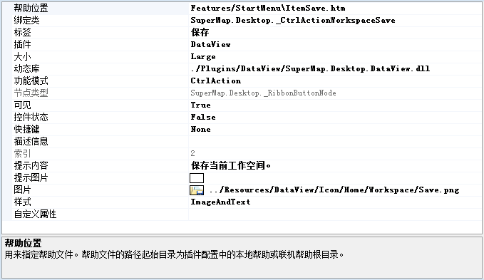

工作环境设计窗口中的属性浏览设置用来显示和修改应用程序中的界面元素的属性，从而实现元素的界面风格和所绑定的功能的设置和修改。

属性浏览设置区显示的内容为当前选中的界面元素所具有的属性信息，选中要显示和修改的界面元素有两种方式：

  1. 在预览区中点击选中要进行修改的界面元素，这里只能选中开始菜单中的控件和功能区上的控件；
  2. 在结构区中的目录树中，点击选中要进行修改的界面元素所对应的结点。

选中界面元素后，属性浏览设置区中将显示该界面元素的属性信息，如下图所示，表格的第一例为该界面元素具有的属性，第二列为相应的属性值。

工作环境设计窗口的属性浏览设置区所显示的界面元素的属性与应用程序所提供的用来在插件配置文件中配置该界面元素的标签所具有的
属性是完全相同的，实质上，在工作环境设计窗口中显示的内容就是从相应的插件配置文件中提取的界面配置内容，并且在工作环境设计窗口中所做的任何修改，
通过保存后，相应的插件配置文件中该界面元素的属性信息也将随之被更改。

注意：有关各个属性的含义和作用，可以参见附录1。

  

