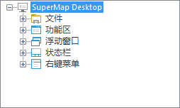

以界面结构模式显示时，结构区的目录树的根结点的下一级有五个结点：开始菜单、功能区、浮动栏集、状态栏集和右键菜单集，这五个结点体现了应用程序界面的五大部分，
应用程序的界面部分将按照其自身特有的结构组织属于该部分的界面元素，因此，在结构区中，各大界面部分对应结点下的其他结点的层次结构，正是该界面部分对于其界面元素
的组织方式的体现，用户可以根据这样的层次方式方便地找到某个界面元素，进而进行设置。

  

  
下面详细介绍应用程序五大界面部分是如何组织其界面元素的，进而了解工作环境设计窗口的结构区的目录树结构。

 [文件菜单](StartMenuCus)

 [功能区](RibbonCus)

 [浮动窗口](FloatWinCus)

 [状态栏](StatusBarCus)

 [右键菜单](ContextMenuCus)
