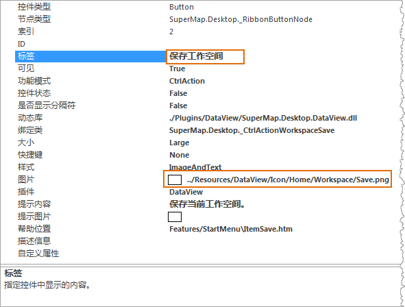
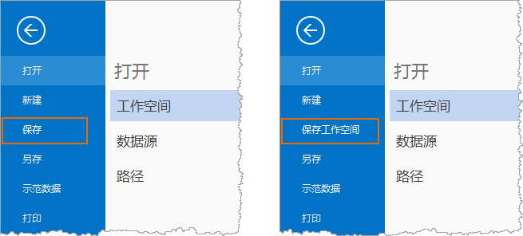

下面对文件菜单中的“保存”按钮进行定制，将该控件的显示名称修改为“保存工作空间”，并修改控件上显示的图标为新的图标，图标文件路径为：D:\Data\SaveWS.png。

1. 选中文件菜单中的“保存”按钮，两种方式：
  * 点击工作环境设计窗口中预览区的文件按钮，在弹出的文件菜单中选中“保存”按钮；
  * 在工作环境设计窗口中结构区中，找到“保存”按钮对应的结点，并选中。
2. 在属性浏览设置区，显示了“保存”按钮控件的属性；
3. 在属性浏览设置区，修改控件的显示名称，属性“标签”用来设置控件的显示名称，将其属性值修改为“保存工作空间”；  

  

4. 修改控件的显示图标，属性“图片”用来设置控件的显示图标，该属性值为图标文件的路径，可以为相对路径，也可以为绝对路径，用户可以在此输入新图标文件的路径（D:\Data\SaveWS.png）；也可以点击该属性值单元格，点击单元格右侧出现的小按钮 ，通过“打开”对话框来定位和选择图标文件。
5. 修改后，可以在预览区域看到修改后的效果，如下所示；  

  

6. 如果确定保存修改的结果，点击工作环境设计窗口中的“确定”按钮，关闭工作环境设计窗口并应用修改的设置。

