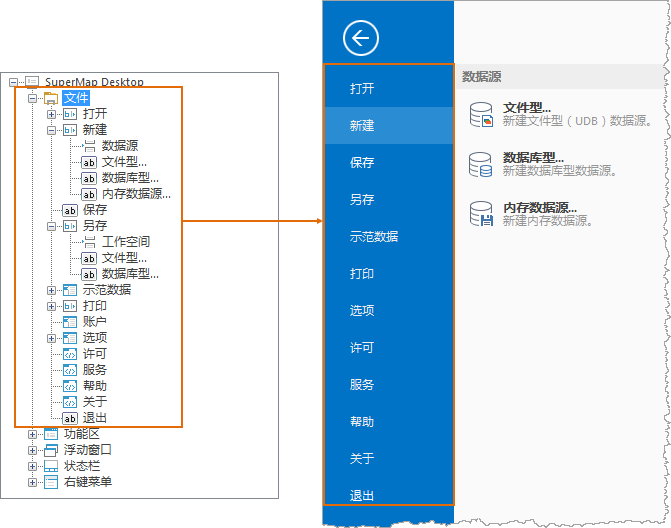

在工作环境设计窗口中，点击预览区最左上角的“文件”按钮，弹出的菜单为文件菜单，文件菜单的界面元素都放置在“文件”根结点下。

工作环境设计窗口的结构区中，根结点下显示名称为“文件”的结点对应预览区中的文件菜单，文件菜单上的控件一一对应着文件菜单结点下的结点。放置在文件菜单下控件对应的结点为“文件”结点的子结点，各个子结点处可设置该结点的二级菜单。

结构区中对应文件菜单中的界面元素的结点，其结点的显示名称为该界面元素在界面上所显示的名称。

  
