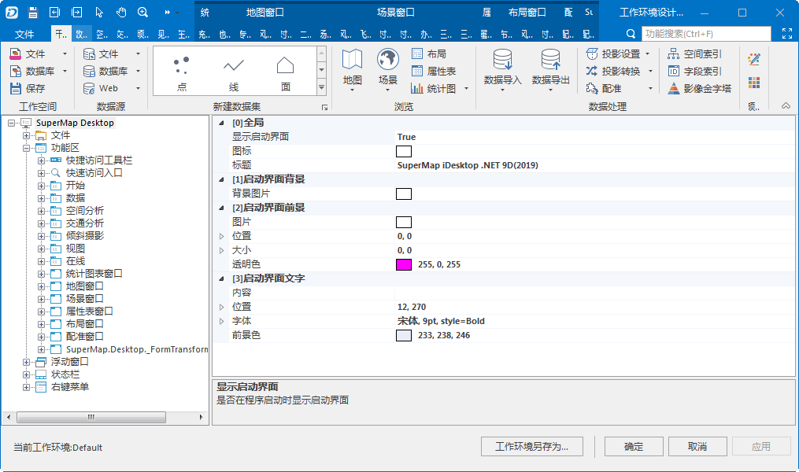

桌面应用程序是一个方便工作环境设计和扩展的应用系统，它提供了一个可视化定制和扩展的窗口，如下图所示，通过这个可视化窗口，用户无需编写大篇幅、复杂的配置代码，只需要在工作环境设计窗口中进行简单的设置，就可以实现相应的定制和扩展操作。

  

下面详细介绍如何在工作环境设计窗口中实现应用程序的定制和功能扩展。

 [工作环境设计窗口介绍](UserCustomUI)

 [如何定制应用程序中已有的界面元素](CustomUIElement)

[如何向应用程序中添加新的界面元素](../../guides/UI_index)

[应用程序的工作环境与如何保存定制工作环境](SaveWKEnvironment)

