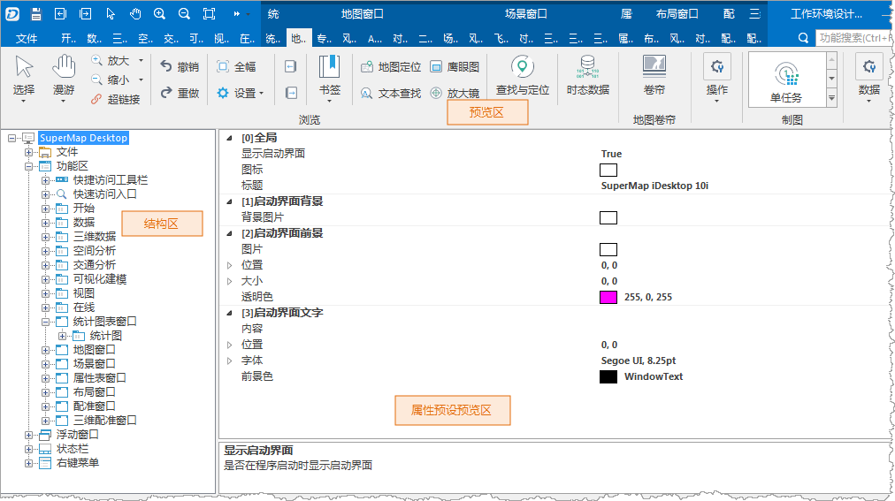

启动应用程序，位于功能区“ **视图** ”选项卡“ **自定义界面** ”组中“ **环境设计**
”下拉菜单内的“工作环境设计”按钮，用来打开工作环境设计窗口。应用程序支持多个工作环境的切换，在进行工作环境设计时，首先将要进行定制和扩展的工作环境切换为当前工作环境，即在功能区/“
**工具** ”选项卡/“ **自定义界面**
”组中的“工作环境选择”标签下方的下拉框中选择目标工作环境，则工作环境设计窗口当前显示的内容为用户选择的工作环境的内容，工作环境设计窗口只能对当前工作环境进行定制和扩展。

完成定制和扩展的工作环境设计窗口主要分为三大区域，如下图所示，包括：

* [预览区：](PreviewRegion)预览用户在定制窗口中对应用程序中的界面元素修改后的效果。
* [结构区：](StructureRegion)以目录树的形式列出应用程序中所有可定制、可扩展的元素，同时，该区域还可以实现新元素的添加。
* [属性浏览设置区：](PropertyRegion)浏览和设置应用程序中的元素的属性，从而实现元素的界面风格和所绑定的功能的设置和修改。

  
