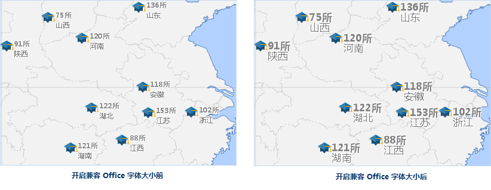

### 兼容 Office 字体大小

SuperMap 地图中的字体显示大小与 Micorsoft Office 字体大小不同，地图中相同字号的文本，SuperMap 显示标准要比
Micorsoft Office 标准的字体显示小。在“ **地图属性** ”面板中，勾选“兼容 Office
字体大小”复选框，即开启字体兼容模式，地图中的文本将按照 Micorsoft Office 标准大小显示字体；若不勾选该复选框，则依照 SuperMap
字体大小标准显示。

新建地图窗口时，默认开启字体兼容模式，打开用 SuperMap iDesktop 7C(V7.1)
之前版本保存的地图时，则默认不勾选该复选框，用户可根据需要勾选“兼容 Office 字体大小”选项。

 |   
---|---  
开启兼容 Office 字体大小前 | 开启兼容 Office 字体大小后  
  
