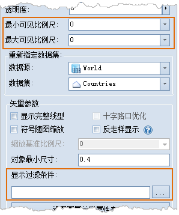
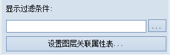
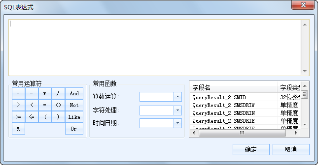
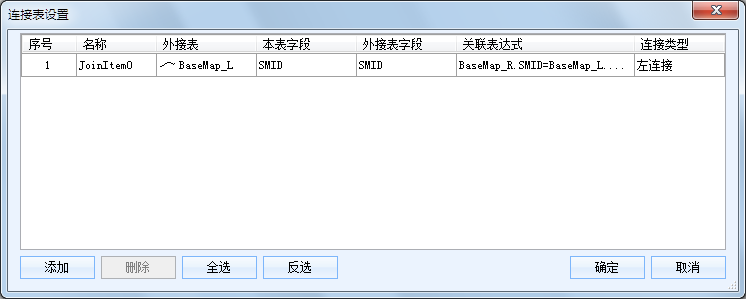

“ **图层属性** ”界面中提供了图层的过滤显示功能，可通过设置可见比例尺或者设置过滤条件对图层中的对象进行过滤。

  
 
图：过滤设置  
  
### 显示过滤条件

“显示过滤条件:”按钮用来设置当前图层的显示过滤条件，过滤图层中哪些对象可显示哪些对象不可显示，便于用户根据需要显示感兴趣的要素而过滤掉暂时不需要显示的要素。

  
 
图：显示过滤条件设置  
用户可以在“显示过滤条件”的文本框中输入 SQL 表达式作为过滤条件，单击 Enter
（回车）键即可应用图层的过滤条件，使图层中满足过滤条件的对象可见；用户还可以单击文本框右侧的
按钮，在弹出的[“SQL
表达式”对话框](../../Query/SQLDia.htm)中构建过滤表达式，设置完成后单击“确定”按钮即可应用图层的过滤条件，使图层中满足过滤条件的对象可见。

  
 
图：“SQL 表达式”对话框  
  
单击“设置图层关联属性表...”按钮，弹出[“连接表设置”对话框](../../Query/JoinItemsDia.htm)，如下所示，通过关联字段连接外部表，进而通过构建有外部表字段参与的过滤条件来过滤显示图层中的内容。

  
 
图：“连接表设置”对话框  
  
