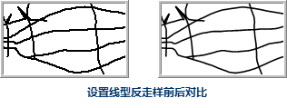
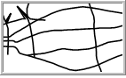

### 线型反走样

线型反走样是指使地图中矢量数据集的线条平滑，消除锯齿的显示效果。

 |   
---|---  
设置线型反走样前| 设置线型反走样后  

### 启用线型反走样

在“ **地图属性**
”界面中，勾选“线型反走样”复选框即可在当前地图窗口中对线型对象启用反走样功能。如果勾选该复选框，表示地图中的线型应用反走样效果；否则，不应用反走样效果。

### 注意事项

* 若勾选“线型反走样”复选框后，未看到地图反走样的的效果，可查看“图层属性”面板中的“反走样显示”是否开启，需同时开启地图反走样和图层反走样，才可生效。
* 只有在图层透明度为0时，线型反走样才可生效；否则反走样无效。

