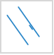

### 显示完整线型

显示完整线型保证线对象的线型符号能完整地显示，帮助用户优化线符号的显示效果。

如果线对象的长度小于线符号周期长度，或者线对象长度不够线符号周期长度的整数倍时，不足线符号的周期的那部分线就不能完全显示。使用显示完整线型命令就会把线符号长度重新整除，计算出一个和线对象长度非常近似的长度绘制。

如图线符号风格为，在线对象长度不足线符号一个周期时，使用显示完整线型和不使用显示完整线型的示意图如下：
|  
---|---  
不显示完整线型| 显示完整线型  
  
因此，显示完整线型命令对于长度较短以及折线较多的线图层的显示效果较好，可以达到美化地图的目的。

  

