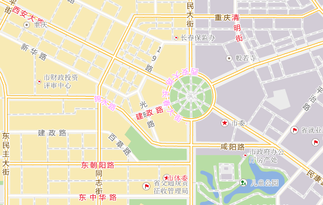

### 冲突检测

文本标签是一种将描述性文本添加至地图中标识各要素的简单方法。地图中的文本标签是动态显示的，通常地图的空间不能同时显示所有标签。点击“地图”选项卡“诊断”分组中的“冲突检测”按钮，可查看与自标签位置冲突和与其他标签位置有冲突的文本标注。开启“冲突检测”后，与自标签位置冲突的标签显示为粉红色，与其他标签位置冲突的标签显示为红色，如下图所示：

  
  
### 备注

自标签位置冲突通常在沿线标注的标签处出现，因为沿线标注后标签的每个文本拆分为一个单独的对象，若字间距小，则容易出现自冲突的现象。

