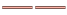

### 十字路口优化

对于线图层，常会出现多个线对象相互交叉的情况，例如水系、道路。如果不作处理，按照正常情况显示，不仅不够美观，而且可能与实际情况不相符，不能正确表达交叉的线对象之间的连通性。

如下图所示，我们往往需要对相互交叉的线进行优化，去除“路口”位置相互交叠的部分，最终达到真实的十字路口显示效果。

 |   
---|---  
未使用十字路口优化 | 使用十字路口优化  
  
  * 十字路口优化功能适用于普通线图层、网络数据线图层，不适用于 CAD 数据的线图层和路由数据。
  * 十字路口优化功能，只对图层风格为双线线型的线对象起作用，如，而对于一些线型符号，如单线线型符号不适用，如。

### 启用十字路口优化

在“ **图层属性**
”界面中，勾选“十字路口优化”复选框即可在当前图层中的线型对象启用十字路口功能。如果勾选该复选框，表示对图层中的线型应用十字路口优化效果；否则，不应用十字路口优化效果。

 |   
---|---  
使用十字路口优化前|使用十字路口优化后  
  
