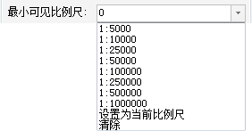
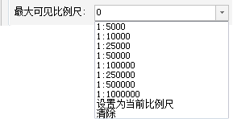

“图层属性”选项卡中提供了图层的过滤显示功能，可通过设置可见比例尺或者设置过滤条件对图层中的对象进行过滤。

  
 
图：过滤显示功能  
  
### 最小可见比例尺

“最小可见比例尺:”组合框用来设置当前图层的最小可见比例尺。图层设置最小可见比例尺后，若地图的比例尺小于该图层设置的最小可见比例尺，该图层将不可见。

  
 
图：最小可见比例尺设置  
  
用户可以通过在“最小可见比例尺”右侧的数字调整框输入比例尺数值，如
1：500000，将当前地图比例尺设置为最小可见比例尺。也可单击右侧下拉按钮选择比例尺设置为最小可见比例尺，下拉项可选比例尺为默认 1:5000 至
1:1000000 的 8 个比例尺；若地图设置了固定比例尺，则下拉项可选比例尺为固定的比例尺。

### 最大可见比例尺

“最大可见比例尺:”组合框用来设置当前图层的最大可见比例尺。图层设置最大可见比例尺后，若地图的比例尺大于该图层所设置的最大可见比例尺时，该图层将不可见。

  
 
图：最大可见比例尺设置  
  
用户可以通过在“最大可见比例尺”右侧的数字调整框输入比例尺数值，如
1：500000，将当前地图比例尺设置为最大可见比例尺。也可单击右侧下拉按钮选择某个比例尺设置为最大可见比例尺，下拉项可选比例尺为默认 1:5000 至
1:1000000 的 8 个比例尺；若地图设置了固定比例尺，则下拉项可选比例尺为固定的比例尺。

