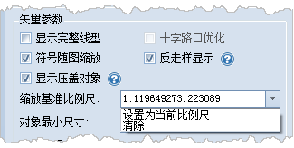

在“ **图层属性** ”界面中包括了了图层属性、图层状态设置、显示参数设置等功能控件。

### 启用符号随图缩放

“符号随图缩放”复选框用来设置在地图放大、缩小浏览操作过程中，图层中的地图符号对象是否也随之放大或者缩小。“符号随图缩放”复选框可应用于点状符号、线状符号、面填充符号及其边框。

勾选“符号随图缩放”复选框后，当前图层中的地图符号会随地图缩放。

### 缩放基准比例尺

用户每执行一次地图放大或缩小操作，当前图层中的符号对象缩放的程度由缩放基准比例尺和地图缩放后的比例尺共同来确定。如果当前地图的比例尺大于缩放基准比例尺，则地图符号会按相同的放大比例进行放大；反之，地图符号会按相同的缩小比例缩小。例如，若符号缩放基准比例尺为
1：500000，此时符号的大小为 30，则当地图比例尺为 1：100000 时，即地图放大五倍，符号的大小也会随之放大五倍，符号大小变为 150。

勾选“符号随图缩放”复选框后，“缩放基准比例尺”组合框变为可用状态，用户可点击其下拉按钮，选择下拉列表中的“设置为当前比例尺”项，设置当前地图窗口中地图的比例尺作为缩放基准比例尺；用户也可选择下拉列表中的“清除”项，即可取消缩放基准比例尺的设置，此时“缩放基准比例尺”组合框中的显示为空，表示符号不随地图缩放。

  

### 备注

当缩放基准比例尺和地图当前比例尺不一致时，勾选掉符号缩放（即不启用符号随图缩放时），可能导致当前地图窗口中的符号大小发生变化，此时符号显示会由缩放基准比例尺大小缩放至当前地图比例尺大小显示。

