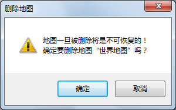

### 使用说明

“删除地图”命令，用来将该地图从工作空间的地图集合中删除。

### 操作步骤

  1. 右键单击工作空间管理器中的想要删除的地图结点，在弹出的右键菜单中选择“删除地图”。
  2. 弹出提示对话框，询问用户是否真的删除选择的地图，单击对话框中的“确认”按钮，删除选中的地图；单击“取消”按钮，则取消此次删除操作。  

  

### 注意事项

  1. 可以在工作空间管理器中先同时选中多个地图，然后再右键单击鼠标，在弹出的右键菜单（同样是地图结点的右键菜单）中选择“删除地图”命令，可以实现一次删除多个选中的地图。
  2. 按 Delete 键也可以删除地图。

