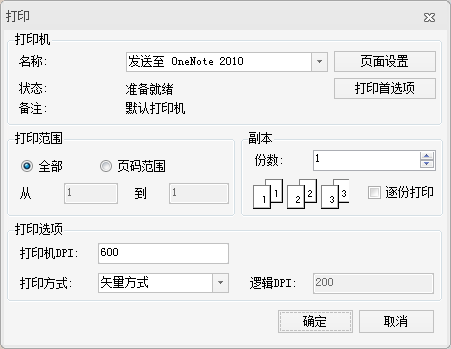

### 使用说明

“打印地图”功能用于直接打印已保存的地图。

### 操作步骤

  1. 在“工作空间管理器”中选中需打印的地图，单击其右键，选中“打印地图...”项。
  2. 在弹出“打印预览”对话框中，单击“打印”按钮，弹出“打印”对话框，如下图所示。
  

图：“打印”对话框  
  3. 在弹出“打印”对话框中，选择打印机并设置相关的打印参数，具体说明如下： 
  * **打印范围：** 获取或设置要打印的页码。
  * **副本：** 获取或设置要打印的副本数，默认值为1。
  * **打印选项：**
    * 打印机 DPI：获取或设置打印机的分辨率。
    * 打印方式：获取或设置矢量或栅格的打印方式。单击该“打印方式”右侧的下拉按钮，在弹出的下拉菜单中设置方式打印。以矢量方式打印的速度要大大高于以栅格方式打印的速度，但是前者对于渐变或者半透明效果打印不出来，而栅格打印则可以打印出这些特殊效果。
    * 逻辑 DPI：获取或设置布局打印处理时的逻辑 DPI，默认值为200。“逻辑 DPI”项只在选择以栅格方式打印时为可用状态，主要用于布局打印时预处理栅格化，逻辑 DPI 与打印设备 DPI 越接近时，打印效果越好。通常情况下，使用默认值200即可。当对打印效果要求高时，可以该属性值就要设置成较大的值；另外，值越大消耗的内存越多，速度会相应的减慢。
  4. 单击“打印”对话框中的“页面设置”按钮，弹出“打印页面设置”对话框，如下图所示。“打印页面设置”对话框中可设置可根据需要选择合适的纸张大小、纸张方向、页边距、采用当前页面设置等参数。 

**采用当前页面设置** ：单击该按钮，表示使用布局设置的纸张大小、页边距等页面参数进行打印；否则按照打印机默认的页面参数进行打印。
  5. 单击“打印”对话框中的“确定”按钮，即可完成打印地图操作。

### 注意事项

  1. 在打印地图之前，需要连接打印机和其他输出设备，并且对它们进行参数设置。用户可通过 Windows 控制面板安装打印机和配置端口。打印选项会根据连接的打印机作相应的变化。有关打印机的安装及缺省选项可以参考操作系统的文档，在此不再赘言。

