### 使用说明

地图输出为 PDF文件，是一种广泛使用的地图输出方式，其优势在于：

  * 第一，可以方便地将地图共享给非GIS用户，只需用户计算机安装PDF阅读器；
  * 第二，由于PDF允许保留矢量图形和嵌入字体，它可以提供高质量的地图打印素材，是重要的硬拷贝印刷交换格式； 
  * 第三，地图和布局输出为PDF文件，有效解决了大幅出图的问题。

SuperMap iDesktop
地图或布局输出为PDF的效果如下图所示，矢量和影像地图都支持输出为PDF，且输出的内容和显示效果与地图或布局基本保持一致。

**注** ：文档结尾部分列举了目前暂不支持输出到PDF的地图效果 ，您可以采用所提供的替代方案修改地图，进而获得正确的输出效果。

<table class=MsoNormalTable border=1 cellspacing=0 cellpadding=0 width=690
 style='width:517.65pt;border-collapse:collapse;border:none'>
 <tr>
  <td width=359 valign=top style='width:269.6pt;border:solid gray 1.0pt;
  padding:0cm 5.4pt 0cm 5.4pt'>
  
<b>地图/布局</b>

  </td>
  <td width=331 valign=top style='width:248.05pt;border:solid gray 1.0pt;
  border-left:none;padding:0cm 5.4pt 0cm 5.4pt'>
  
<b>PDF</b><b>文件</b>

  </td>
 </tr>
 <tr>
  <td width=690 colspan=2 valign=top style='width:517.65pt;border:solid gray 1.0pt;
  border-top:none;padding:0cm 5.4pt 0cm 5.4pt'>
  
网格聚合图

  </td>
 </tr>
 <tr>
  <td width=359 valign=top style='width:269.6pt;border:solid gray 1.0pt;
  border-top:none;padding:0cm 5.4pt 0cm 5.4pt'>
  
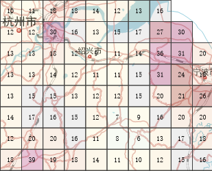

  </td>
  <td width=331 valign=top style='width:248.05pt;border-top:none;border-left:
  none;border-bottom:solid gray 1.0pt;border-right:solid gray 1.0pt;padding:
  0cm 5.4pt 0cm 5.4pt'>
  
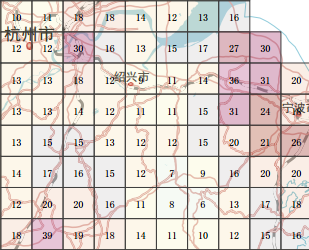

  </td>
 </tr>
  <tr>
  <td width=690 colspan=2 valign=top style='width:517.65pt;border:solid gray 1.0pt;
  border-top:none;padding:0cm 5.4pt 0cm 5.4pt'>
  
热力图

  </td>
 </tr>
 <tr>
  <td width=359 valign=top style='width:269.6pt;border:solid gray 1.0pt;
  border-top:none;padding:0cm 5.4pt 0cm 5.4pt'>
  

  </td>
  <td width=331 valign=top style='width:248.05pt;border-top:none;border-left:
  none;border-bottom:solid gray 1.0pt;border-right:solid gray 1.0pt;padding:
  0cm 5.4pt 0cm 5.4pt'>
  
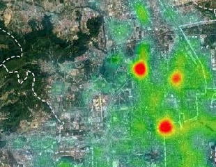

  </td>
 </tr>
 <tr>
  <td width=690 colspan=2 valign=top style='width:517.65pt;border:solid gray 1.0pt;
  border-top:none;padding:0cm 5.4pt 0cm 5.4pt'>
  
交通线路图

  </td>
 </tr>
 <tr>
  <td width=359 valign=top style='width:269.6pt;border:solid gray 1.0pt;
  border-top:none;padding:0cm 5.4pt 0cm 5.4pt'>
  
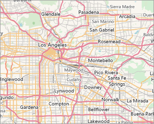

  </td>
  <td width=331 valign=top style='width:248.05pt;border-top:none;border-left:
  none;border-bottom:solid gray 1.0pt;border-right:solid gray 1.0pt;padding:
  0cm 5.4pt 0cm 5.4pt'>
  
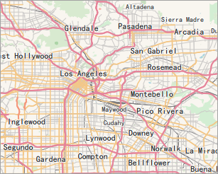

  </td>
 </tr>
 <tr>
  <td width=359 valign=top style='width:269.6pt;border:solid gray 1.0pt;
  border-top:none;padding:0cm 5.4pt 0cm 5.4pt'>
  
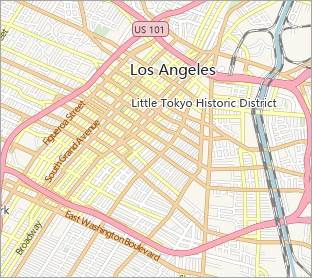

  </td>
  <td width=331 valign=top style='width:248.05pt;border-top:none;border-left:
  none;border-bottom:solid gray 1.0pt;border-right:solid gray 1.0pt;padding:
  0cm 5.4pt 0cm 5.4pt'>
  
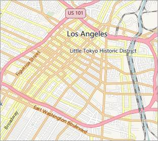

  </td>
 </tr>
 <tr>
  <td width=690 colspan=2 valign=top style='width:517.65pt;border:solid gray 1.0pt;
  border-top:none;padding:0cm 5.4pt 0cm 5.4pt'>
  
POI

  </td>
 </tr>
 <tr>
  <td width=359 valign=top style='width:269.6pt;border:solid gray 1.0pt;
  border-top:none;padding:0cm 5.4pt 0cm 5.4pt'>
  
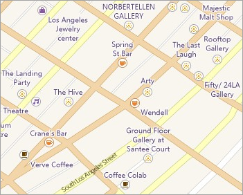

  </td>
  <td width=331 valign=top style='width:248.05pt;border-top:none;border-left:
  none;border-bottom:solid gray 1.0pt;border-right:solid gray 1.0pt;padding:
  0cm 5.4pt 0cm 5.4pt'>
  

  
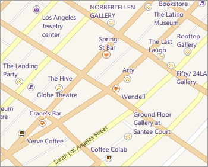

  </td>
 </tr>
 <tr>
  <td width=359 valign=top style='width:269.6pt;border:solid gray 1.0pt;
  border-top:none;padding:0cm 5.4pt 0cm 5.4pt'>
  
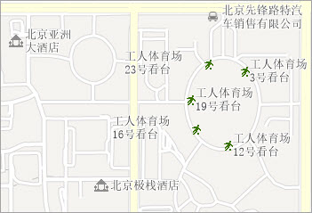

  </td>
  <td width=331 valign=top style='width:248.05pt;border-top:none;border-left:
  none;border-bottom:solid gray 1.0pt;border-right:solid gray 1.0pt;padding:
  0cm 5.4pt 0cm 5.4pt'>
  
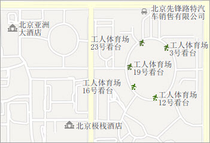

  </td>
 </tr>
 <tr>
  <td width=690 colspan=2 valign=top style='width:517.65pt;border:solid gray 1.0pt;
  border-top:none;padding:0cm 5.4pt 0cm 5.4pt'>
  
影像地图

  </td>
 </tr>
 <tr>
  <td width=359 valign=top style='width:269.6pt;border:solid gray 1.0pt;
  border-top:none;padding:0cm 5.4pt 0cm 5.4pt'>
  
·

  </td>
  <td width=331 valign=top style='width:248.05pt;border-top:none;border-left:
  none;border-bottom:solid gray 1.0pt;border-right:solid gray 1.0pt;padding:
  0cm 5.4pt 0cm 5.4pt'>
  
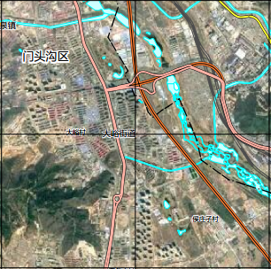

  </td>
 </tr>
 <tr>
  <td width=690 colspan=2 valign=top style='width:517.65pt;border:solid gray 1.0pt;
  border-top:none;padding:0cm 5.4pt 0cm 5.4pt'>
  
专题图

  </td>
 </tr>
 <tr>
  <td width=359 valign=top style='width:269.6pt;border:solid gray 1.0pt;
  border-top:none;padding:0cm 5.4pt 0cm 5.4pt'>
  
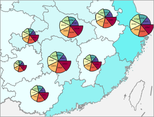·

  </td>
  <td width=331 valign=top style='width:248.05pt;border-top:none;border-left:
  none;border-bottom:solid gray 1.0pt;border-right:solid gray 1.0pt;padding:
  0cm 5.4pt 0cm 5.4pt'>
  
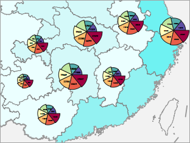

  </td>
 </tr>
</table>
 
###  功能入口

使当前地图窗口中没有选中的对象。

  * 在地图窗口->右键->右键菜单中选择“地图输出为 PDF”，弹出“输出为 PDF”对话框。

###  参数说明

  * **分辨率** ：输出分辨率或输出图像的 DPI（每英寸点数）。值越高通常图像越清晰，但随着DPI值的增大，输出PDF的文件大小和处理时间也会显著增加。默认情况下，输出DPI值为96。 
  * **背景透明** ：勾选该复选框，则输出PDF文件中地图的背景透明。
  * **输出范围** :可以设置输出的地图范围，如：整幅地图或当前地图窗口范围；输出PDF结果文件中的地图比例尺为当前地图比例尺。
  * 设置完成后，单击对话框中的“确定”按钮即可执行导出操作，输出窗口处会提示导出是否成功。

###  输出结果

  * **图层树**

PDF文件保留了地图的图层树结构，并可以在PDF中开启和关闭图层的可见性。

地图和布局输出的PDF中，如下图所示，左侧为图层树，PDF中保留了地图图层树结构与图层名称，但是图层顺序与地图图层树相反，原因在于地图图层绘制顺序为从下到上，而PDF绘制图层的顺序时从上到下。

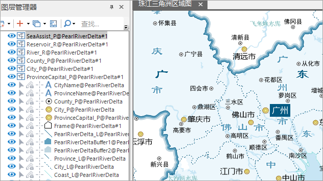  

下图为地图输出为PDF结果：  
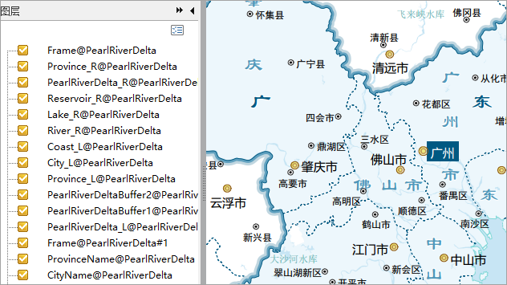  

  * **图层可见性**

在PDF图层树中，每个图层前面的复选框可以控制图层的可见性，如下图所示。

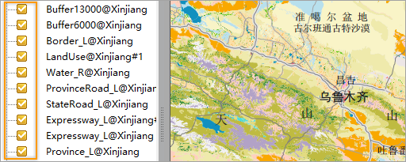  

  * **编辑地图内容**

地图/布局输出为PDF后，PDF保留了地图的矢量图形和文字，因此，利用PDF编辑器的编辑功能，可以编辑地图中的部分矢量要素和文字。但是，不建议在PDF中进行大量的地图相关的编辑操作，这里只适合对地图进行微调整，例如，调整个别标签文本的位置。

###  PDF输出支持情况

地图对象中的地图内容基本都可以正确输出到PDF文件中，并且为“所见即所得”的输出方式，即当前地图对象中显示的内容与输出的PDF中的地图内容一致。

目前，个别地图效果暂不支持输出到PDF中，具体如下：
<table class=MsoNormalTable border=1 cellspacing=0 cellpadding=0
 style='border-collapse:collapse;border:none'>
 <tr>
  <td width=140 style='width:110.8pt;border:solid black 1.0pt;padding:0cm 5.4pt 0cm 5.4pt'>
  
&nbsp;

  </td>
  <td width=180 style='width:180.2pt;border:solid black 1.0pt;border-left:none;
  padding:0cm 5.4pt 0cm 5.4pt'>
  
地图/布局

  </td>
  <td width=180 style='width:180.8pt;border:solid black 1.0pt;border-left:none;
  padding:0cm 5.4pt 0cm 5.4pt'>
  
PDF

  </td>
  <td width=110 style='width:180.0pt;border:solid black 1.0pt;border-left:none;
  padding:0cm 5.4pt 0cm 5.4pt'>
  
替代方案

  </td>
 </tr>
  <tr>
  <td width=140 style='width:110.8pt;border:solid black 1.0pt;border-top:none;
  padding:0cm 5.4pt 0cm 5.4pt'>
  
不支持特殊形状的地图对象 (圆角矩形、圆形、椭圆、多边形)

  </td>
  <td width=180 style='width:180.2pt;border-top:none;border-left:none;
  border-bottom:solid black 1.0pt;border-right:solid black 1.0pt;padding:0cm 5.4pt 0cm 5.4pt'>
  

  </td>
  <td width=180 style='width:180.8pt;border-top:none;border-left:none;
  border-bottom:solid black 1.0pt;border-right:solid black 1.0pt;padding:0cm 5.4pt 0cm 5.4pt'>
  
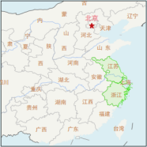

  </td>
  <td width=110 style='width:180.0pt;border-top:none;border-left:none;border-bottom:
  solid black 1.0pt;border-right:solid black 1.0pt;padding:0cm 5.4pt 0cm 5.4pt'>
  
无

  </td>
 </tr>
 <tr>
  <td width=140 style='width:110.8pt;border:solid black 1.0pt;border-top:none;
  padding:0cm 5.4pt 0cm 5.4pt'>
  
图层透明度

  </td>
  <td width=180 style='width:180.2pt;border-top:none;border-left:none;
  border-bottom:solid black 1.0pt;border-right:solid black 1.0pt;padding:0cm 5.4pt 0cm 5.4pt'>
  
使用了图层透明度

  </td>
  <td width=180 style='width:180.8pt;border-top:none;border-left:none;
  border-bottom:solid black 1.0pt;border-right:solid black 1.0pt;padding:0cm 5.4pt 0cm 5.4pt'>
  
矢量图层的图层透明度丢失，栅格和影像的图层透明度有效

  </td>
  <td width=110 style='width:180.0pt;border-top:none;border-left:none;border-bottom:
  solid black 1.0pt;border-right:solid black 1.0pt;padding:0cm 5.4pt 0cm 5.4pt'>
  
使用颜色透明度制作出图层透明的效果。

  </td>
 </tr>
  <tr>
  <td width=140 style='width:110.8pt;border:solid black 1.0pt;border-top:none;
  padding:0cm 5.4pt 0cm 5.4pt'>
  
栅格/影像数据集设置显示范围

  </td>
  <td width=180 style='width:180.2pt;border-top:none;border-left:none;
  border-bottom:solid black 1.0pt;border-right:solid black 1.0pt;padding:0cm 5.4pt 0cm 5.4pt'>
  
栅格或者影像数据集通过如下方式设置了显示范围。
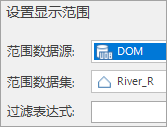

  </td>
  <td width=180 style='width:180.8pt;border-top:none;border-left:none;
  border-bottom:solid black 1.0pt;border-right:solid black 1.0pt;padding:0cm 5.4pt 0cm 5.4pt'>
  
显示范围设置无效

  </td>
  <td width=110 style='width:180.0pt;border-top:none;border-left:none;border-bottom:
  solid black 1.0pt;border-right:solid black 1.0pt;padding:0cm 5.4pt 0cm 5.4pt'>
  
通过分析方法对数据集进行裁剪，提取显示范围区域。

  </td>
 </tr>
 <tr>
  <td width=140 style='width:110.8pt;border:solid black 1.0pt;border-top:none;
  padding:0cm 5.4pt 0cm 5.4pt'>
  
系统线型System1-4

  
&nbsp;

  </td>
  <td width=180 style='width:180.2pt;border-top:none;border-left:none;
  border-bottom:solid black 1.0pt;border-right:solid black 1.0pt;padding:0cm 5.4pt 0cm 5.4pt'>
  
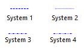

  </td>
  <td width=180 style='width:180.8pt;border-top:none;border-left:none;
  border-bottom:solid black 1.0pt;border-right:solid black 1.0pt;padding:0cm 5.4pt 0cm 5.4pt'>
  

  </td>
  <td width=110 style='width:180.0pt;border-top:none;border-left:none;border-bottom:
  solid black 1.0pt;border-right:solid black 1.0pt;padding:0cm 5.4pt 0cm 5.4pt'>
  
使用自定义线型制作不支持的系统符号。

  </td>
 </tr>
  <tr>
  <td width=140 style='width:110.8pt;border:solid black 1.0pt;border-top:none;
  padding:0cm 5.4pt 0cm 5.4pt'>
  
文字效果

  </td>
  <td width=180 style='width:180.2pt;border-top:none;border-left:none;
  border-bottom:solid black 1.0pt;border-right:solid black 1.0pt;padding:0cm 5.4pt 0cm 5.4pt'>
  
文字设置了粗体效果

  </td>
  <td width=180 style='width:180.8pt;border-top:none;border-left:none;
  border-bottom:solid black 1.0pt;border-right:solid black 1.0pt;padding:0cm 5.4pt 0cm 5.4pt'>
  
若本地计算机存在相应字体的粗体字库，显示正常；否则粗体效果无效。
  </td>
  <td width=110 style='width:180.0pt;border-top:none;border-left:none;border-bottom:
  solid black 1.0pt;border-right:solid black 1.0pt;padding:0cm 5.4pt 0cm 5.4pt'>
  
本地计算机安装相应字体的粗体字库。例如：文字使用了微软雅黑字体，并设置加粗，那么您的电脑中要具有微软雅黑粗体字库。 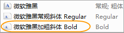

  </td>
 </tr>
  <tr>
  <td width=140 style='width:110.8pt;border:solid black 1.0pt;border-top:none;
  padding:0cm 5.4pt 0cm 5.4pt'>
  
多语言文字

  </td>
  <td width=180 style='width:180.2pt;border-top:none;border-left:none;
  border-bottom:solid black 1.0pt;border-right:solid black 1.0pt;padding:0cm 5.4pt 0cm 5.4pt'>
  
显示正常 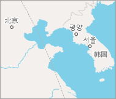

  </td>
  <td width=180 style='width:180.8pt;border-top:none;border-left:none;
  border-bottom:solid black 1.0pt;border-right:solid black 1.0pt;padding:0cm 5.4pt 0cm 5.4pt'>
  
可能会出现乱码 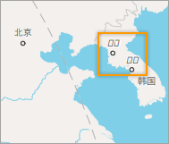

  </td>
  <td width=110 style='width:180.0pt;border-top:none;border-left:none;border-bottom:
  solid black 1.0pt;border-right:solid black 1.0pt;padding:0cm 5.4pt 0cm 5.4pt'>
  
本地计算机安装相应语言文字的字体库。 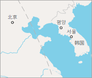

  </td>
 </tr>
 
 
 <tr>
  <td width=140 style='width:110.8pt;border:solid black 1.0pt;border-top:none;
  padding:0cm 5.4pt 0cm 5.4pt'>
  
图像填充符号

  </td>
  <td width=180 style='width:180.2pt;border-top:none;border-left:none;
  border-bottom:solid black 1.0pt;border-right:solid black 1.0pt;padding:0cm 5.4pt 0cm 5.4pt'>
  
显示正常 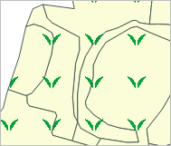

  </td>
  <td width=180 style='width:180.8pt;border-top:none;border-left:none;
  border-bottom:solid black 1.0pt;border-right:solid black 1.0pt;padding:0cm 5.4pt 0cm 5.4pt'>
  
填充边界与面对象边界可能存在不吻合现象，填充边界出现锯齿情况。  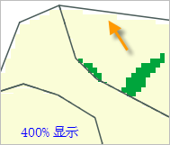

  </td>
  <td width=110 style='width:180.0pt;border-top:none;border-left:none;border-bottom:
  solid black 1.0pt;border-right:solid black 1.0pt;padding:0cm 5.4pt 0cm 5.4pt'>
  
建议使用纯色填充作为填充背景，填充的内容（如左图的茶园符号），建议使用矢量符号制作填充符号。 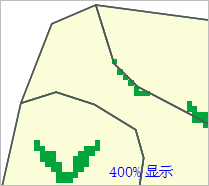

  </td>
 </tr>
 
</table>

