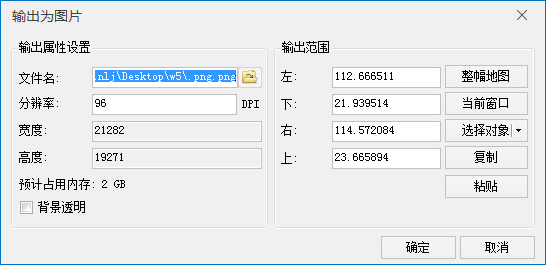

### 使用说明

支持将当前地图窗口中的地图输出为通用的图片格式，支持的图片文件的格式包括：*.bmp、*.jpg、*.png、*.gif、*.eps、*.tif等类型。

###  操作说明

  1. 使当前地图窗口中没有选中的对象。
  2. 在地图窗口中右键单击鼠标，在弹出的右键菜单中选择“地图输出为图片”命令，弹出“输出为图片”对话框。
  
---  
图：“输出为图片”对话框  
  3. “输出属性设置”区域可设置输出图片的保存路径和名称、分辨率、背景透明等参数，具体操作说明如下： 
  * **文件名** ：单击右侧按钮，在弹出的“保存”对话框中设置图片的保存路径和名称，也可直接在“文件名”文本框中输入图片保存路径和名称。
  * **分辨率** ：可在标签右侧的文本框中设置输出图片分辨率，分辨率值域范围是[1,2000]，当设置分辨率大于最大值，程序将给出警告提示。目前支持对 *.bmp，*.jpg，*.png，*.tif 格式的图片设置分辨率。默认：96，单位：DPI。 

应用程序将根据分辨率和输出范围预估输出图片占用内存的大小，若地图输出为图片占用内存大于指定限额时（64位操作系统限额为1.6GB，32位操作系统限额为200M），会提示用户将地图输出为
PDF。 有关输出为PDF的详细说明请参看[输出为PDF](WinMap_OutputPDF.htm)。

  * **宽度** ：用于显示当前地图窗口中输出图片的宽度，单位为像素。
  * **高度** ：用于显示当前地图窗口中输出图片的高度，单位为像素。
  * **背景透明** ：若选择输出为 *.png 或 *.gif 格式，可通过勾选“背景透明”复选框，设置输出的图片是否背景透明。 
  4. **输出范围** ：用于设置输出为图片的地图范围，应用程序提供了当前窗口、整幅地图、选择对象、复制粘贴四种设置方式，具体说明如下： 
  * **整幅地图** ：单击选中“整幅地图”单选框，即可将当前地图中的所有图层范围的并集设置为输出范围；
  * **当前窗口** ：单击选中“当前窗口”单选框，即可将当前窗口的地图范围设置为输出范围；
  * **选中对象** ：提供了 **选择对象** 和 **绘制范围** 两种方式，“选择对象”是指在当前地图窗口中通过鼠标框选或点选方式，选中一个或多个对象，将选中对象范围设置为输出范围；“绘制范围”是指在当前地图窗口中，通过单击鼠标绘制，确定一个矩形区域为输出范围。
  * **复制粘贴** ：单击“ **复制** ”按钮可复制当前设置的范围，在支持粘贴的范围设置处单击“粘贴”按钮，即可将复制范围的左、下、右、上值设置到当前范围。
  5. 设置完成后，单击“输出为图片”对话框中的“确定”按钮即可。

### 注意事项

  1. 将地图输出为图片时，专题图的流动显示和自动避让功能无效。请预先处理地图，关闭流动显示和自动避让功能。

