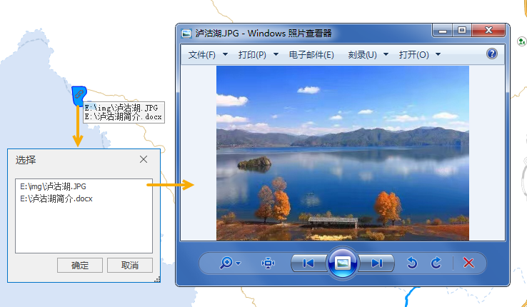

### 使用说明

支持将 **文本型** 或 **宽字符型** 属性字段设置为 **超链接** ，开启地图 **超链接**
之后，可单击地图中的矢量对象可打开对应的超链接属性，超链接可定义为以下两种类型：

  * **文件** ：图片、Excel、Word、视频等，单击超链接对象时，会使用对应的应用程序打开链接的文件。
  * **URL** ：网址，单击超链接对象时，会使用默认的web浏览器打开对应的网页。

**应用场景** ：

  * 可应用于查看矢量数据的图片，如查看建筑物、湖泊、景点等对象对应的实景照片。
  * 可用于查看地图中公司的详细介绍文档。

### 操作说明

  1. 在 **工作空间管理器** 中，选中要设置超链接字段的数据集，单击鼠标右键->选择 **属性** 菜单。
  2. 在 **属性** 面板-> **属性表** 中，单击工具栏中的  **超链接** 按钮，在弹出的宽字符和文本型字段列表中，勾选需设置为超链接的字段点击 **确定** ，并单击工具栏中的 **应用** 按钮。    
 3. **编辑超链接字段值** ：若超链接内容为URL，可直接填写网址；若超链接内容为文件，可填写文件的绝对路径，或相对于*.udb的相对路径，如图片在UDB上一级目录的img文件夹中，则相对路径写为“ **..\img\pic.png** ”。
  4. **开启地图超链接** ：在地图窗口打开带超链接字段的数据集，单击 **地图** -> **浏览** -> **超链接** 按钮，当超链接按钮为选中状态时，即可查看地图窗口中矢量对象链接的文件。
  5. 将鼠标移至地图窗口，鼠标会变成，将鼠标移至地图中，会显示鼠标所在对象的链接内容，单击矢量对象，即可查看其超链接对应的文件。若该对象有多个超链接字段，则单击鼠标会弹出选择对话框，对话框中显示了该对象的所有超链接内容，单击某项超链接查看即可。
  

查看超链接图片结果  
  6. 结束超链接浏览：在地图窗口中单击鼠标右键；或再次单击 **地图** -> **浏览** -> **超链接** 按钮，使其处于非选中状态。

### 注意事项

  * 超链接字段类型只支持 **文本型** 和 **宽字符型** 两种。
  * 若想取消字段的超链接，在数据集 **属性** -> **属性表** 工具栏中，单击 **超链接** 按钮，在列表取消字段勾选，单击 **应用** 即可。

