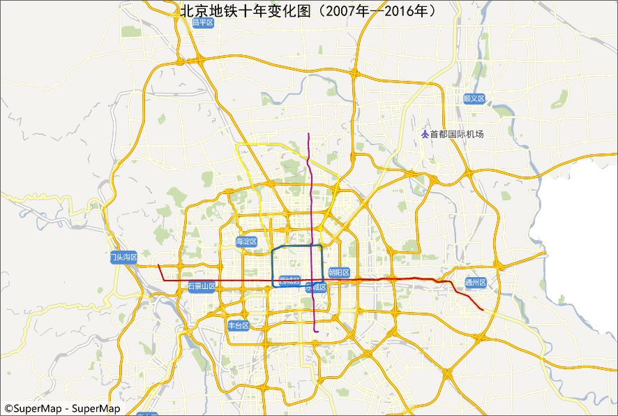

### 使用说明

闪烁是针对卷帘图层，按照设定的时间间隔将卷帘图层隐藏，然后再次显示。可用于历史数据和现势数据的对比显示。

图层闪烁功能设置如下图所示，按钮“闪烁”，用来开启或者关闭图层的闪烁状态，按钮按下状态，表示图层闪烁；按钮非按下状态，表示取消闪烁。另外，闪烁功能和地图卷帘功能互斥，当前只能为两者之一的操作状态。

### 操作步骤

  1. 打开目标地图，地图闪烁的功能集成在“ **地图** ”选项卡中的“ **地图卷帘** ”分组中的“卷帘”功能中。
  2. 单击“ **卷帘** ”按钮，弹出“地图卷帘对话框”,在“ **选择图层** ”列表中选择当前地图的闪烁图层，可选择任意图层或者图层分组，但不可选择图层组下的图层。
  3. 设置图层闪烁的时间间隔，即图层隐藏、显示的时间间隔，时间的数值单位为毫秒。
  4. 单击选项卡中的“闪烁”按钮，闪烁图层则会根据指定的时间 间隔隐藏并显示，具体效果如下图所示：
  

