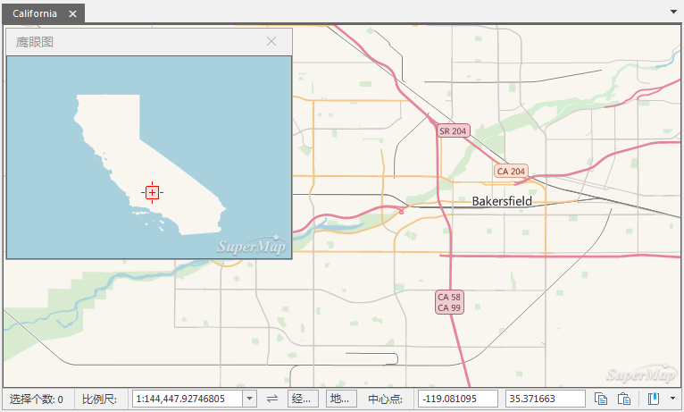
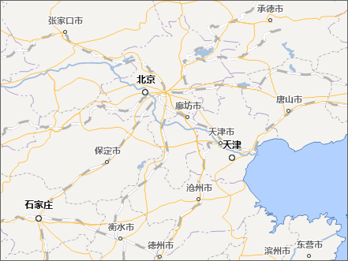

### 使用说明

鹰眼图即地图显示范围的缩略图，可显示当前地图窗口在整幅地图中的位置。通过拖动鹰眼图对话框中的矩形框可改变当前地图的显示区域范围，是地图浏览中常用的功能之一。

### 操作步骤

  1. 在“ **地图** ”选项卡中的“ **浏览** ”组中，单击“ **鹰眼图** ”按钮，弹出“ **鹰眼图** ”对话框。
  2. 鹰眼图对话框默认显示整幅地图的缩略图，其中，红色矩形框表示的是当前地图窗口的显示范围，拖动矩形框可改变当前地图显示的位置。
  3. 同时，在地图窗口中通过平移、缩放等操作浏览地图时，鹰眼图中的范围标识矩形框位置也会实时变化。  
  
 |   
---|---  
“鹰眼图”对话框 | 地图显示内容  

### 注意事项

  * 当在鹰眼图中拖动矩形框到地图范围外时，“鹰眼图”对话框会提示“地图超出显示范围”，且不显示红色矩形框。

