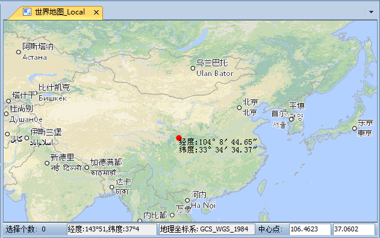

### 使用说明

地图定位可根据指定的坐标值，在地图中进行查找，定位到地图某一位置并以红色圆点标识该点位置，同时，还可对该点的添加坐标标注。

### 功能入口

  * **地图** -> **浏览** -> **地图定位** 按钮。

  1. **地图定位** 对话框默认显示当前地图窗口的中心点坐标，单位与当前地图坐标一致。分别在对话框中输入坐标值，单击“定位”按钮，或按“Enter”键，即可定位到指定坐标处，并以红色标识点闪烁显示在当前地图窗口中。
  2. 若当前地图为地理坐标系，可切换为 **以“度:分:秒”形式显示** 显示，可将坐标输入框切换为度:分:秒的形式进行设置。
  3. 若地图为投影坐标系，默认使用X/Y坐标进行定位，可勾选 **使用经纬度定位** 复选框，切换为经纬度坐标进行定位。
  4. 若勾选“添加标注”复选框，可对定位点添加位置标注。
  5. 定位和标注结果如下图所示：    
---  
地图定位及添加标注结果  

### 注意事项

  * 若定位点不在当前地图窗口显示范围内，则定位后地图窗口会切换为以该点为中心的视图显示；若定位点在当前地图窗口显示范围内，则定位后当前地图窗口显示范围不变。
  * 若定位后当前地图窗口未显示红色标识点，则该点应被“地图定位”对话框遮挡，用户将对话框移开或关闭即可看到标识点。

