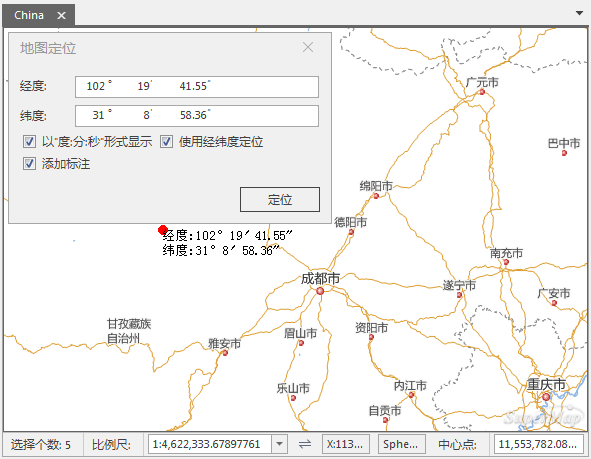

### 使用说明

“地图定位”按钮提供了定位到地图某一坐标处的功能，方便用户进行定位查找。直接输入定位点的坐标值进行查找，即可以红色圆点标识该点位置，同时，还可对该点的添加坐标标注。

### 操作步骤

  1. 在“ **地图** ”选项卡中的“ **浏览 <**”组中，单击“ **地图定位** ”按钮，弹出“ **地图定位** ”对话框。
  2. 对话框默认显示当前地图窗口的中心点坐标，单位与当前地图坐标一致。分别在对话框中输入坐标值，单击“定位”按钮，或按“Enter”键，即可定位到指定坐标处，并以红色标识点闪烁显示在当前地图窗口中。
  3. 若当前地图为地理坐标系，则可勾选 **以“度:分:秒”形式显示** 复选框，将坐标输入框切换为度:分:秒的形式进行设置。
  4. 若勾选“添加标注”复选框，可对定位点添加位置标注。
  5. 定位和标注结果如下图所示：   
     

### 注意事项

  * 若定位点不在当前地图窗口显示范围内，则定位后地图窗口会切换为以该点为中心的视图显示；若定位点在当前地图窗口显示范围内，则定位后当前地图窗口显示范围不变。
  * 若定位后当前地图窗口未显示红色标识点，则该点应被“地图定位”对话框遮挡，用户将对话框移开或关闭即可看到标识点。

