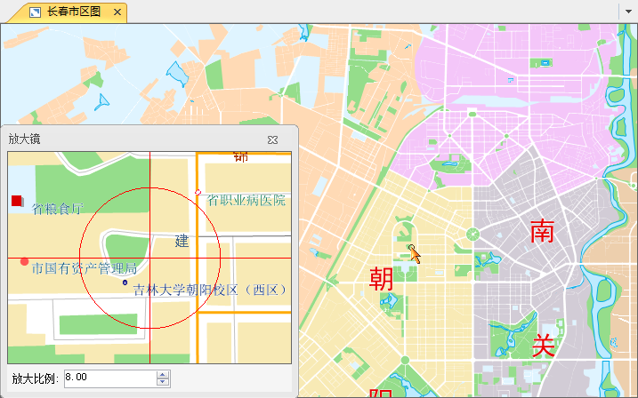

### 使用说明

地图放大镜是指将地图窗口中的内容加载到“放大镜”窗口中，并以指定的放大倍数放大显示地图内容。“放大镜”窗口显示的内容会随着鼠标在地图上的移动而实时改变，同时，放大镜的十字标的位置跟着鼠标的移动而移动，始终与鼠标位置一致。

### 操作步骤

  1. 在“ **地图** ”选项卡中的“ **浏览** ”组中，单击“ **放大镜** ”按钮，弹出“ **放大镜** ”对话框。
  2. 放大镜窗口以鼠标所在位置为中心点显示地图，窗口的显示内容会随着鼠标在地图上的移动而实时改变。
  3. 在放大镜窗口中设置“放大比例”值，可调整放大镜窗口的地图显示的放大倍数。
  
