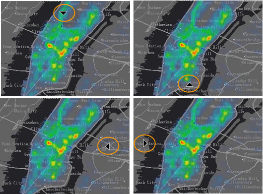
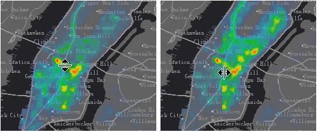

### 使用说明

卷帘功能通常用在遥感影像的浏览操作，一般通过卷帘操作查看叠加在一起的两幅影像的差别，其操作效果为：鼠标在上层影像（被卷帘）进行上下或左右拉动，模拟一种将影像上下或左右卷起的动作，从而呈现出下层影像。现在，卷帘操作不仅可以应用于影像，也可以应用于地图中的其他图层，如下面的演示动态图，矢量地图上叠加了一个栅格图层，对栅格图层进行卷帘操作。

### 应用场景

地图卷帘可以用于以下几个场景：

  1. 多时相遥感影像，查看不同时相影像的差异；
  2. 多版本缓存，查看同一地区不同缓存数据间的差异；
  3. 矢量图层，尤其是行政界线，查看界线的变化等；

被卷帘的图层可以是任意矢量图层、栅格图层、影像图层、缓存图层，同时，地图卷帘操作还可将图层分组作为被卷帘对象，即其下的所有图层都将作为一个图层进行卷帘操作。

### 操作步骤

  1. 先打开目标地图，地图卷帘的功能分布在“ **地图** ”选项卡中的“ **地图卷帘** ”分组中。
  2. 单击“ **卷帘** ”按钮，弹出“地图卷帘对话框”,在该对话框中可进行地图的卷帘、闪烁、渐变的操作设置。 
  3. 单击“ **选择图层** ”下拉按钮，在列表中选择当前地图中的卷帘图层，可选择任意图层或者图层分组，但不可选择图层组下的图层。
  4. 单击“ **卷帘** ”按钮，按钮变为按下状态，切换当前地图窗口中的鼠标操作状态为卷帘操作，此时，鼠标移动到地图窗口后，鼠标状态为箭头，根据鼠标在地图窗口中的位置不同，鼠标的箭头方向不同，即可以进行卷帘的方向不同，不同的鼠标状态，如下图所示：
  
 
  5. 切换到卷帘操作鼠标状态后，就可以根据需要，按住鼠标左键并上下或者左右拖动鼠标，对被卷帘图层进行卷帘，此时，根据当前是左右还是上下卷帘，鼠标将显示不同的状态图标。
  
  6. 如果想取消鼠标卷帘操作状态，可以再次按下“卷帘”按钮，按钮变为非按下状态，即可取消卷帘操作；也可在地图窗口中单击鼠标右键，取消地图卷帘操作。
  7. 地图卷帘的操作演示图如下动画所示：
  

### 小技巧

  * 当前地图窗口为卷帘操作状态时，按住 Ctrl 键的同时按下鼠标左键，卷帘图层将全部隐藏，释放鼠标左键，卷帘图层显示。
  * 当前地图窗口为卷帘操作状态时，按住 Shift 键的同时按下鼠标左键，卷帘图层及显示顺序在其上的所有图层都将参与卷帘浏览操作。

