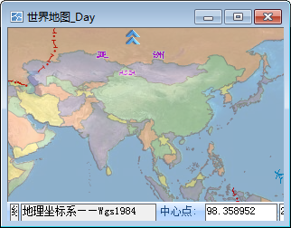
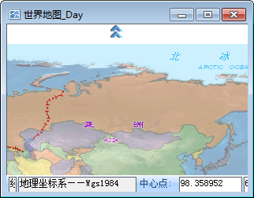

当用户在地图窗口中操作时，如果想平移地图以便查看没有显示在地图窗口中地图部分，并且不方便切换地图窗口中的操作状态为漫游地图状态，可开启自动滚屏功能。

### 操作步骤

  1. 在“ **地图** ”选项卡中“ **浏览** ”组中，单击“ **设置** ”下拉按钮，在下拉菜单中选中“ **自动滚屏** ”即可。
  2. 在弹出的“设置”对话框中勾选“ **自动滚屏** ”复选框，实现自动滚屏，即当鼠标靠近地图窗口的边界时（如下面左图所示），鼠标自动变化为自动滚屏的状态，此时，单击鼠标左键，将实现地图的一次平移（如下面右图所示）。      

  |  
  ---|---    
  图：自动滚屏前 | 图：自动滚屏后  
  
当地图窗口中的操作状态为“放大”、“缩小”、“自由缩放”、“漫游”时，自动滚屏功能不可用。

