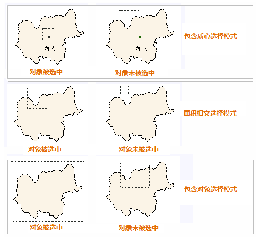

“选择”下拉按钮提供了在当前地图窗口中进行对象选择的功能，包括多种对象选择方式。该按钮包含两个部分：一是按钮部分，单击该部分可以直接执行相应的功能；二是下拉按钮部分，单击该部分将弹出下拉菜单，通过
选择下拉菜单中的项来进一步实现相应的功能。

在地图窗口中选择对象时，要保证所要选择的对象所在的图层为可选择状态，否则对象将不能被选中。

### Ctrl+A 全选

当图层为可选择状态，且鼠标焦点在地图中，同时按键盘中的“Ctrl+A”键，即可选中地图中的所有对象。按“Esc”键可取消选中。

### 点选和矩形框选择

单击“ **地图** ”选项卡中“ **浏览** ”组中的“ **选择** ”下拉按钮的按钮部分，或者单击其下拉按钮部分，在弹出的下拉菜单中 单击“
**选择** ”项，即可使用点选或者拖框选择的方式选择地图中的对象。

单击“选择”项后，当前地图窗口的操作状态变为点选状态，并且鼠标在当前地图窗口中的状态变为  。

  * 点选：用户可通过鼠标单击选择对象。当选择另一个对象后，之前已选中对象的选择状态被撤销；选择一个对象后，按住 Shift 键，再次选择其他对象时，可同时选中多个对象。
  * 框选：用户可通过单击鼠标左键并按住不放，沿对角线拖动鼠标，出现一个大小随着鼠标移动而变化的临时矩形。在适当位置松开鼠标 左键，确定用于选择的矩形区域，则质心在矩形区域内的所有对象都被选中。用户可通过按住 Shift 键继续进行矩形框选择，在原有基础上增加选中的对象。

### 圆形选择

圆形选择方式，是指通过绘制一个临时圆形区域，选中圆形区域内符合选择模式的对象。单击该下拉按钮，在弹出的下拉菜单中选择“圆形选择”项。当前地图窗口的操作状态变为圆形选择状态，并且
鼠标在当前地图窗口中的状态变为  。

  * 在地图窗口中某个位置单击鼠标左键，该位置即绘制的临时圆形区域的圆心。拖动鼠标，在拖动鼠标的过程中会看到半径不断变化的临时圆。
  * 在适当位置处再次单击鼠标 左键，即可通过确定临时圆的半径确定用于选择的圆形区域，则质心在圆形区域内的所有对象被选中。
  * 用户可通过按住 Shift 键继续进行圆形选择，在原有基础上增加选中的对象。

### 多边形选择

多边形选择方式，是指通过绘制一个临时多边形区域，选中多边形区域内符合选择模式的对象。单击该下拉按钮，在弹出的下拉菜单中选择“多边形选择”项。当前地图窗口的操作状态变为多边形选择状态，并且
鼠标在当前地图窗口中的状态变为。

  * 在地图窗口中连续单击鼠标左键，绘制一个临时多边形，当完成绘制临时多边形区域时单击鼠标右键来结束绘制，则质心在该多边形 区域内的所有对象被选中。
  * 用户可通过按住 Shift 键继续进行多边形选择，在原有基础上增加选中的对象。

### 画线选择

画线选择方式，是指通过绘制一条临时折线段，选中与折线段相交的对象。单击该下拉按钮，在弹出的下拉菜单中选择“画线选择”项。当前地图窗口的操作状态变为画线选择状态，并且鼠标在当前地图窗口中的状态变为 。

  * 在地图窗口中连续单击鼠标左键，绘制一条临时的折线，单击鼠标右键完成折线的绘制，则与折线相交的所有对象将被选中。
  * 用户可通过按住 Shift 键继续进行画线选择，在原有基础上增加选中的对象。

以上几种选择方式可以混合使用，只要在选择对象时按住 shift 键，就可以在原有基础上增加选中的对象。
支持跨图层选择，因此，地图窗口中所有可选择图层中满足选择条件的对象都会被选中，被选择的对象将以特殊的状态（选择状态）显示出来。

### 选择模式

在当前地图窗口进行选择对象操作时，支持以绘制矩形框、圆形和多边形等方式进行选择。

“选择模式”提供了三种选择模式：包含质心、面积相交和包含对象。

  * 包含质心：当对象的质心被临时矩形框所包含时，对象被选中。
  * 面积相交：当临时矩形框与对象之间存在相交部分时，对象被选中。
  * 包含对象：当临时矩形框完全包含对象时，被包含的对象被选中。

以绘制临时矩形框选择对象的方式为例，对三种对象选择模式的解释如下图所示。图中的虚线矩形框表示选择对象的临时矩形框，多边形表示地图上的几何对象。

  

### 点选容限

“点选容限”主要用来控制选择对象的精确度，即在选对象时，通过设定一个容限值，当光标与地图对象的距离小于设置的选择容限（以像素为单位）时，对象被选中。用户直接在文本框中输入容限值即可。

### 多对象选择交互

在地图窗口选择多个相互压盖的对象时，通过右键的“ **选择对象**”功能，可查看选择对象的前20个对象列表，在列表中可查看对象所属图层，当鼠标在列表选中某一对象，同时该对象会在地图中高亮显示，帮助用户快速定位并选择对象。

