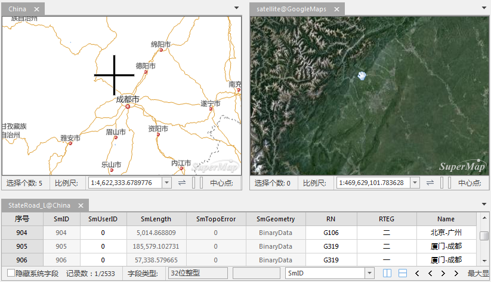

###  使用说明

关联浏览可将多个窗口进行绑定，从而使这些窗口的操作实现联动操作，例如：在相互绑定的某个窗口中漫游、缩放地图，从而改变窗口中显示内容的范围，那么，其他与之绑定的窗口也将自动定位到相应的显示范围。

关联浏览功能支持两个以上窗口之间的联动，支持地图窗口、三维窗口、属性窗口之间的相互绑定；同时在标签模式、扩展模式三种窗口模式情况下，都可实现关联浏览。

###  操作步骤

下面以两个地图窗口间的绑定来描述如何实现窗口的绑定。

1. 选择两个进行绑定的数据，分别在新的地图窗口中打开。这里打开示范数据中的“China”数据和谷歌在线地图satellite。
2. 一般情况下，进行绑定的数据为相同区域范围的不同应用的数据，从而在一次浏览操作中可以实现同时查看一个区域的多类数据。
3. 单击 **视图** 选项卡-> **窗口** -> **关联浏览** 按钮，弹出窗口列表，勾选进行绑定的窗口前的复选框即可进行关联浏览。  
    **全选** ：全部选中绑定窗口列表中的所有窗口。  

    **反选** ：反选绑定窗口列表中的窗口。  
    
    **确定** ：对前面设定的参数确认。
4. 单击绑定窗口列表底部的“确定”按钮，此时以用程序自动对选择的绑定窗口进行水平排列，从而便于窗口间的联动操作与浏览。且各个窗口间的鼠标位置会以十字丝联动显示，如下图所示。
5. 地图中的矢量图层，可直接关联浏览其属性表，在图层管理器中选中矢量图层，单击鼠标右键选择 **关联浏览属性数据** ，即可关联浏览指定图层的属性表，如下图所示。
  
---  
6. 接下来，就可以在其中一个地图窗口中进行漫游、缩放等浏览操作，另一个窗口也将随之进行联动。当关联属性表浏览时，双击属性表中某条记录，地图窗口会快速定位至该对象。特别强调，在对一个窗口中的对象进行编辑修改时，另外一个窗口中的对象也会发生相应的变化。
7. 当具有关联浏览关系的窗口关闭，或者新的关联浏览关系建立后，当前的关联浏览关系自动解除。

### 备注

* 在当前工作空间中存在2个或多个打开的地图、场景或者属性表窗口时，只选择一个窗口是无法进行关联的。
* 当前窗口模式为标签模式、叠加模式或扩展模式时，都可保持当前的窗口模式进行关联浏览。
* 当前工作空间中只保留一组关联关系，如果已经存在一组关联关系，然后又建立新的一组关联关系，则旧的关联关系会自动解除，只保留新的关联关系。
* 关联浏览时，多个窗口的顺序与打开顺序有关，即按照窗口打开的顺序，按照从左到右，从上到下的顺序排列。
* 在进行关联浏览时，地图和场景窗口会并列显示，若有属性表窗口参与关联浏览，则属性表窗口会默认显示在窗口的下半部分。
* 当选中的关联对象大部分区域或完全显示在当前视图范围中时，不会改变地图的视图范围，只会高亮关联对象，尽量减少地图的刷新次数。
* 属性表在进行关联浏览时，默认情况下选中属性表整列关联地图中不会高亮显示所有对象，若需高亮显示所有对象，可以通过属性表整列右键菜单中的“高亮所有对象”进行设置。

