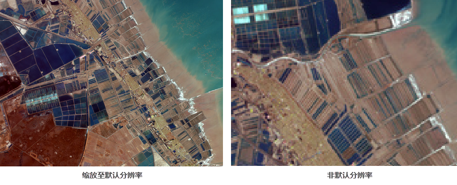

### 使用说明

通过 **缩放至默认分辨率** 功能，可将栅格/影像图层调整至最佳的显示状态，显示效果最清晰。

调整时保持地图的中心点不变，将栅格影像的分辨率与屏幕分辨率调整为1:1，即屏幕的一个像素对应栅格影像数据的一个像元。此时若进一步放大该栅格图层，也不会获得更清晰的显示效果，反而可以看到栅格的一个个像元。若当前地图上存在有其他数据集，则这些数据集将以同一分辨率显示。

**操作说明** ：在图层管理器中选中一个栅格图层->单击鼠标右键->选择 **缩放至默认分辨率**
，此时，时地图会根据选中的栅格图层的分辨率来调整缩放比例，使得该图层的显示大小与其影像分辨率相一致。

  

