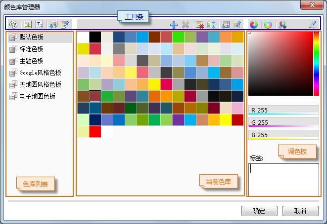
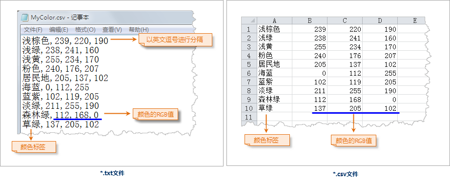

颜色库管理器提供了对当前颜色库中的颜色进行高级管理的功能，可以更为灵活、专业地管理颜色集合。

在颜色库管理器中，可以完成以下任务：

  * 添加色板，构建符合实际应用需要的颜色集合。
  * 导入/导出颜色库文件。
  * 从图片文件中拾取颜色，构建新的色板。
  * 为颜色添加标签。

  

  
### 添加/删除色板

颜色库管理器左侧的“色板列表”区域列出了当前颜色库中的全部色板，可以通过“色板列表”顶部工具条上的“新建色板”按钮，添加一个新的色板。

在色板列表中显示了色板的名称，选中一个色板，在“色板”区域将显示该色板的内容，即色板包含的所有色块。色板顶部的“色板工具条”提供了一系列的功能，可以实现对当前色板的管理操作。

### 色库操作

  * **修改色板名称：** 新添加的色板使用默认名称，在“色板列表”中选中某个色板，然后再次单击色板名称，可以使该色板名称变为可编辑状态，从而可以修改色板的名称。
  * **导入颜色库文件：** “色板工具条”上的“导入颜色库文件”按钮，可以载入色板文件（*.xml文件），使当前色板显示的内容为该文件所保存的色板，即导入前的原色板被重置为文件中的色板。
  * **导出当前颜色库：** “色板工具条”上的“导出当前颜色库”按钮，可以将对应的色板导出为*.xml 文件，该文件记录了色板的颜色信息。
  * **新建色块：** “色板工具条”上的“新建色块”按钮，可以在当前色库的末尾追加一个新的色块，颜色默认为右侧调色板当前的颜色，可以通过选中该新添加的色块，在调色板上为其设置新的颜色。

为了在颜色选择器中加载色板时所有的色块完全显示，一个颜色库中最多可以添加 140 个色块。

  * **修改色块的颜色：** 鼠标单击选中要修改的色块，然后再右侧的调色板上选择新的颜色，也可以通过调色板下方的数值设置颜色值。
  * **删除色块：** “色板工具条”上的“删除色块”按钮，可以删除对应的色块，单击该按钮后，将删除该色块。
  * **删除重复色块：** 单击“色板工具条”上的“删除重复色块”按钮，可以删除色块列表中重复颜色的色块。
  * **色块排序：** 单击“色板工具条”上的“色块近似排序”按钮，可以对色块列表中的色块基于 RGB 值进行排序。

### 从图片中获取色板

这里，可从已有的图片文件中提取图片中的所有颜色，将这些颜色作为新的色板中的颜色导入到当前颜色库中。

通过“色板列表”顶部工具条中的“从图片采集颜色”按钮，打开“打开”对话框，选择要提取颜色的图片文件，图片文件可以为*.png、*.jpg、*.jpeg、*.bmp、*.gif中的任意格式，选择图片文件后单击“打开”按钮，弹出“提取图片颜色设置”对话框，设置提取过程中使用的参数信息；参数设置完成后，单击“确定”，则在当前颜色库中将新建一个色板（色板的名称默认为图片文件的文件名），色板中的色块为从该图片文件中提取的颜色。

“提取图片颜色设置”对话框的参数说明：

  * 图片：当用于提取颜色的为普通图片时，可以勾选该项，提取的结果将采用默认的容限提取图片中的颜色，容限包括：所提取的颜色间的相近程度，即在容限范围内的两种颜色将视为同种颜色被提取到结果中；提取的颜色在图片中所占的范围如果小于容限值，则该颜色不被提取。
  * 色板截图：一些图片处理软件可能自带一些色板，为了实现将这些色板导入，可以将这些色板截图，然后通过这里提供的从图片拾取颜色的功能，将色板中的颜色拾取进来，如果被拾取颜色的图片为这类色板截图，需要勾选该项。
  * 自定义，如果用户需要自定义拾取颜色的容限，需要勾选该项，此时，其下面的参数编辑框为可用状态，用来设置拾取的容限：“相近色容限”――指定拾取的颜色的RGB值的容限，两种颜色的RGB值如果在容限范围内，则认为是一种颜色，拾取时只拾取一次；“最小采样范围”――提取的颜色在图片中所占的范围百分比如果小于指定的容限值，则该颜色不被提取。

### 从文本文件导入色板

这里，可从记录了颜色的文本文件，将文本文件中的所有颜色作为新的色板中的颜色导入到当前颜色库中。这类文本文件的格式可以为：*.txt 或
*.csv，同时颜色的记录格式要符合一定的要求，如下图所示：第一个逗号（英文逗号）的内容为颜色的标签，之后为 RGB 颜色值，颜色值必须使用 RGB
颜色模式；一行代表一个颜色记录。如果文本文件中存在记录没有严格遵守这个规则，该记录将被忽略，对应的颜色不被导入。

  
通过“色板列表”顶部工具条中的“从文本文件导入色块”按钮，打开“打开”对话框，选择要提取颜色的文本文件，文本文件可以为 *.txt、*.csv
格式，选择文本文件后单击“打开”按钮，则在当前颜色库中将新建一个色板（色板的名称默认为文本文件的文件名），色板中的色块为从该文本文件中记录的颜色。

### 导入/导出颜色库

颜色库管理器当前只能加载管理一个颜色库，颜色库中包含若干个色板，色板实现了对颜色的分类管理，色板中包含了一系列颜色；通过颜色库文件可以将当前颜色库管理器中的颜色库保存为外部文件，即保存当前全部的色板及其中的颜色内容，包括当前色板及颜色的分布结构和状态，便于后续的加载和使用。

  * **导入颜色库文件：** 通过“色板列表”顶部工具条中的“导入颜色库文件”按钮，导入颜色库文件（*.xml）。
  * **导出当前颜色库：** 通过“色板列表”顶部工具条中的“导出当前颜色库”按钮，可以将当前所管理的颜色库导出为*.xml 文件，该 xml 文件记录的当前的所有色板，色板中的颜色内容以及排列顺序等信息，后续将该*.xml 导入后，可以恢复为保存时的色板状态。

### 排列色板中的颜色

在色板中单击要调整顺序的色块，同时按住鼠标左键不放，将其拖动到目标位置，然后释放鼠标左键，即可将选中的颜色移动到该处，实质是将两处的色块互换位置。

### 为色块添加标签

选中色板中的某个颜色，在右侧“调色板”区域的“标签（Tags）”文本框中，可以为选中的颜色输入颜色名称用于标识该颜色；在颜色选择器中进行颜色搜索时，也将以该标签作为搜索对象。

### 关于调色板区域的操作

“调色板”区域主要提供用户进行自定义颜色的场所，调色板下方的区域，提供了 RGB、CMYK、HSB三种颜色模式，用户可以选择需要的颜色模式，通过对应的三个按钮（RGB、CMYK、HSB）实现颜色模式的切换，这里可以通过数值进行调色；也可以通过拾取颜色的方式获取颜色，单击拾取按钮，切换当前鼠标状态为拾取颜色，然后在屏幕上任何区域移动鼠标，可以拾取鼠标当前位置的颜色。

