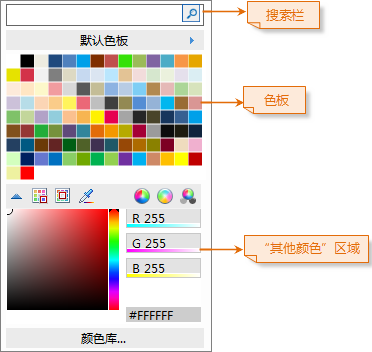
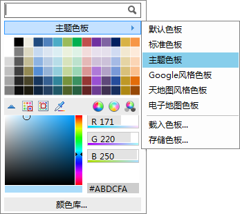
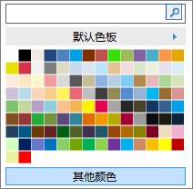

颜色库选择器提供了选择颜色和自定义颜色的功能。颜色库选择器提供了默认色板，其包含了基本颜色；其他颜色区域，用于自定义颜色，并且提供了三种颜色模式（RGB、CMYK、HSB）；最近使用颜色，记录了用户近期使用过的颜色；颜色库，可以打开[颜色库管理器](ColorManager)，对颜色进行高级管理。

  

  
### 搜索颜色

在颜色库选择器色板的上方，提供了搜索栏，可以通过输入颜色的名称来搜索对应的颜色。

### 切换色板

颜色库选择器上的色板默认是“默认色板”，通过单击色板顶部的黑色箭头，打开菜单，该菜单列出了当前颜色库的所有色板，可以通过选择其中的色板，将颜色库选择器上的色板切换为选中的色板。通过[颜色库管理器](ColorManager)可以对色板进行管理。

  

  
另外，该菜单中还提供了对色板操作的其他功能：

  * 载入色板：加载色板文件（*.xml 文件），从而将文件所存储的色板载入作为颜色库选择器的当前色板。
  * 存储色板：将颜色库选择器当前的色板存储为色板文件，即*.xml 文件，通过 XML 格式记录色板中的颜色内容，方便后续加载和使用。

### “其他颜色”区域的功能

下面着重介绍，其他颜色区域的功能使用。

  

  * 收起/展开“其他颜色”区域：单击“其他颜色”按钮，可以展开该区域；单击“收起编辑器”按钮，可以收起该区域的内容。
  * 添加颜色到色板：可以将在该区域选择和设置的颜色，添加到指定的色板，也可将当前设置的颜色添加到颜色库选择器当前的色板中；
  * 拾取颜色：单击“拾取颜色”按钮，切换当前鼠标状态为拾取颜色，然后在屏幕上任何区域移动鼠标，可以拾取鼠标当前位置的颜色值，颜色值将显示在“其他颜色”区域的右侧。
  * 切换颜色模式：颜色的数值可以以三种模式进行显示，包括：RGB、CMYK、HSB，通过“其他颜色”区域右上方的三个按钮（RGB、CMYK、HSB）可以对三种颜色模型进行切换。

### 最近使用的颜色

在颜色库选择器的“最近使用的颜色”区域，将记录用户最近选择使用的颜色。（如果用户未选择过颜色，则“最近使用的颜色”列表不显示。）

### 打开颜色库管理器

在颜色库选择器的下方，单击“颜色库...”按钮，可以打开颜色库管理器。

  
