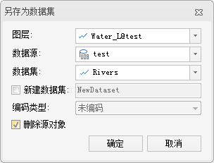

### 使用说明

“另存数据集”命令，用来将选中的对象另存为一个的新的数据集。支持将二维点、线、面、文本数据、三维点、线、面数据以及 CAD
数据集，另存为新的数据集，或保存到已有数据集中。

目前还不支持将选中网络数据集、路由数据集中的对象另存为数据集。

### 操作步骤

  1. 在当前窗口中，以任意一种方式选中要输出的对象。
  2. 在地图窗口中，右击鼠标，在弹出的右键菜单中选择“ **另存为数据集** ”命令，弹出“另存为数据集”对话框中，如下图所示。
  

图：“另存为数据集”对话框  
  3. **图层** ：用于选择选中的对象所在的图层。由于一次只能将某一个图层的选中的对象保存为新数据集，因此，当选中的对象包含于多个图层的时候，需要指定输出哪个图层的选中的对象。
  4. **数据源** ：设置新输出的对象保存在的数据集所在的数据源名称。
  5. **数据集** ：设置新输出的对象保存在的数据集名称，将选中对象保存在已存在的数据集中。
  6. **新建数据集** ：勾选该复选框，表示将选中对象保存在新建的数据集中，设置新输出的对象保存在的数据集所在的数据源名称。
  7. **编码类型** ：若将选中对象保存到新建数据集中，则可设置新数据集的编码方式。支持单字节、双字节、三字节和四字节这四种编码类型，适用于二维线数据集和面数据集。暂不支持对二维点数据集、纯属性数据集、 CAD 数据集和三维矢量数据集设置编码方式。关于编码方式的介绍内容，请参见[数据集压缩编码方式](../../DataProcessing/DataManagement/EncodeType.htm)。
  8. **删除源对象** ：若源数据集为可编辑状态，勾选该复选框，可将源数据集中的选中对象删除。
  9. 单击“确定”按钮，将选中的对象另存为新的数据集。

