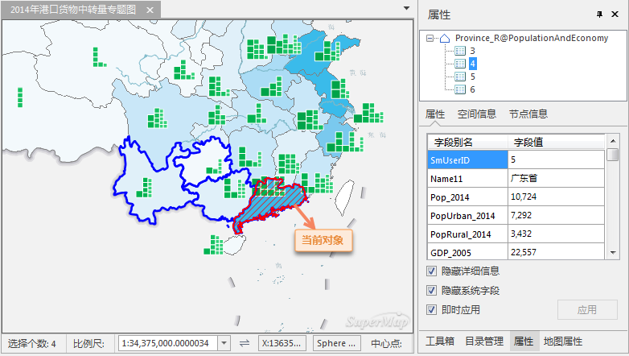

### 使用说明

“属性”命令，用来显示和设置当前地图窗口中选中的一个几何对象的属性信息。

### 操作方式

  1. 在地图窗口中选择一个几何对象。
  2. 在地图窗口中右键单击鼠标，在弹出的右键菜单中选择“属性”命令。
  3. 弹出“属性”窗口，窗口中显示了选中对象的详细信息（如左图所示），包括属性信息、空间信息和构成对象的节点信息。右图为地图窗口中选中的对象。  

|  
---|---  
左图：属性窗口 | 右图：地图窗口  
  
### 注意事项

* 以上查看选中对象的属性信息的方式，仅适用于选中一个对象的情况。
* 如果选中的对象分布在不同的地图图层（各个图层仅选中一个对象时），那么“属性” 窗口中仅显示地图中有选中对象的所有图层中处于最上层的图层中的选中对象的属性信息。

### 相关主题

 [矢量数据集中对象的属性窗口](PropertyWinIntro)

