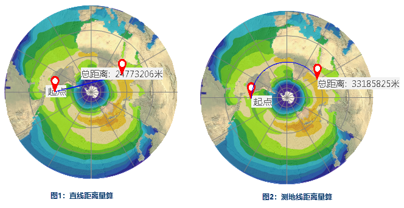
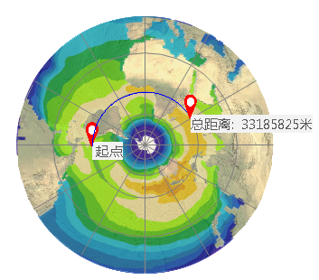
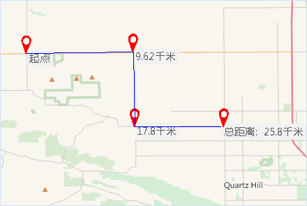
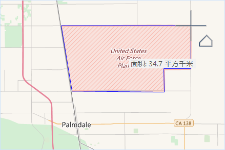
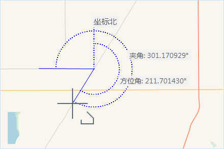

地图量算功能包括在地图上的距离、面积和角度量算。在量算时，用户可以打开智能捕捉功能，便于精确获取感兴趣的位置。在量算过程中，可通过使用 Ctrl+Z
按键，撤销上一步的量算记录。同时支持设置量算单位、清除量算结果。

**注** ：非法面，不支持地图量算。

### 单位

量算之前建议先设置量算单位，在“地图”选项卡的“操作”组中，单击“单位”
按钮，即可在弹出的对话框中分别设置距离、面积、角度的单位。若勾选了对话框中的“自动换算单位”，则量算结果会自动在各子的体制内进行换算，例如：当前量算单位为分米，当量算结果大于或等于10分米时，结果会换算成单位为米进行显示，当量算结果大于或等于1000米是，结果就会换算为以千米为单位来显示。同样英寸、英尺、码、英里也会自动换算。

### 距离量算

距离量算包括直线和测地线两种距离：

  * **直线距离** 是指地图中的任意两点在平面二维空间中的水平距离，不考虑地球的曲率。如下图1所示量算两点间的水平距离。
  * **测地线距离** 是指地图中的任意两点在椭球体（椭圆体）地球表面上最短的线的长度。如下图2所示为两点间在椭球体中的测地线距离。例如，可用于量算两城市机场之间的最短路径距离，以此作为飞行航线。

 |   
---|---  
图1：直线距离量算 | 图2：测地线距离量算  
  
两种量算的操作方式类似，本文以“直线距离”量算操作为例：

  1. 单击“ **操作** ”组中的“ **地图量算** ”下拉按钮，在下拉菜单中选择一种距离量算的选项，当前地图窗口的操作状态变为距离量算状态，并且鼠标在当前地图窗口中的状态变为十字丝。
  2. 在地图窗口中待量算距离的起点位置单击鼠标左键，确定量算距离的起点；移动鼠标，屏幕上会出现连接鼠标当前点和起点的一条长度不断变化的临时线段，同时还显示了这条线段的距离值。
  3. 量算 过程中，地图窗口会同时显示两个结果数值：当前鼠标点与前一点之间的线段长度和当前鼠标点与量算距离的起点间折线段的总长度。在鼠标单击第二个点之前，地图窗口中显示的这两个数值相等；当鼠标单击第二个点后，移动鼠标，地图窗口中显示的两个数值发生变化，当前鼠标点与前一点之间的线段长度始终小于当前鼠标点与起点间折线段的总长度。
  4. 用户可以单击一系列的点来连续进行距离量算，不仅可以获得当前两点间的距离，还可以获得总距离。
  5. 在量算的过程中，用户可单击键盘中的“Tab”键，在两个显示数值间切换。选择数值后，可通过键盘对选中的值进行复制（Ctrl + C），即可将量算结果的数值复制出来。
  6. 单击鼠标右键即可结束距离量算，同时整条折线段的相应位置出现各条线段的数值注记，输出窗口中也显示出整条折线段的总距离值。
  7. 单击“ **量算** ”组中的“ **清除** ”按钮，即可清除当前地图窗口中临时折线和长度量算的数值注记。此外，按“Esc”键也可实现“清除”功能。
  8. 若需要继续进行距离量算，重复第 1 步至第 7 步的操作。
  
---  
图：直线距离量算  

### 面积量算

**操作步骤：**

  1. 单击“ **操作** ”组中的“ **地图量算** ”下拉按钮，在下拉菜单中选择“面积”项，则当前地图窗口的操作状态变为面积量算状态，并且鼠标在当前地图窗口中的状态变为十字丝。
  2. 在当前地图窗口中，鼠标单击待量算面积的区域边界的某位置，即可确定用来量算面积的临时多边形边界的起点。当鼠标单击待量算面积的区域边界上的第二个点时，移动鼠标，当前鼠标点与前两个点构成一个临时面域（不共线的三点即可构成一个面），并且该面随着鼠标的移动而变化。同时，鼠标旁边会显示出当前临时面的面积。
  3. 沿着待量算面积区域的边界线连续单击鼠标，绘制用于量算的临时多边形，即可获得多边形圈定区域的面积。
  4. 在量算的过程中，用户可单击按键盘中的“Tab”键，即可选中当前显示的面积数值，通过键盘对选中的值进行复制（Ctrl + C），即可将量算结果的数值复制出来。
  5. 单击鼠标右键即可结束面积量算，同时临时多边形的相应位置出现其面积的数值注记，输出窗口中也显示出面积量算的数值。
  6. 单击“量算”组中的“清除”按钮，即可清除当前地图窗口中的临时多边形和面积量算的数值注记。此外，按“Esc”键也可实现“清除”功能。
  7. 若需要继续进行面积量算，重复第 1 步至第 6 步的操作。
  
**注** ：非法面，不支持面积量算。

### 角度量算

**操作步骤：**

  1. 单击“量算”组中的“角度”按钮，则当前地图窗口的操作状态变为角度量算状态，并且鼠标在当前地图窗口中的状态变为。
  2. 在当前地图窗口中，鼠标单击待量算角度的位置确定待量算角度一条边的起点，同时该点处形成一条指向正北方向的虚线，移动鼠标即可从起点处形成一条射线，同时显示该射线与正北方向虚线之间的夹角，即该射线的方位角。
  3. 当鼠标单击待量算角度一条边的另一个端点时，即可确定一条边，移动鼠标可由第二个鼠标点引出一条射线，并与第一条边组成一个角度。此时，可显示两个角度量算值：这条射线与第一条边的夹角值以及这条射线的方位角值。
  4. 连续单击鼠标，绘制用于量算角度的边，即可获得各条边确定的方位角和夹角。
  5. 在量算的过程中，用户可单击按键盘中的“Tab”键，即可选中当前显示的角度值，通过键盘对选中的值进行复制（Ctrl + C），即可将量算结果的数值复制出来。
  6. 单击鼠标右键即可结束角度量算，同时临时折线的相应位置出现各个角度的数值注记，输出窗口中也显示出最后绘制的线段的方位角和夹角的数值注记。
  7. 单击“量算”组中的“清除”按钮，即可清除当前地图窗口中的临时折线和角度量算的数值注记。此外，按“Esc”键也可实现“清除”功能。
  8. 若需要继续进行角度量算，重复第 1 步至第 7 步的操作。
  

