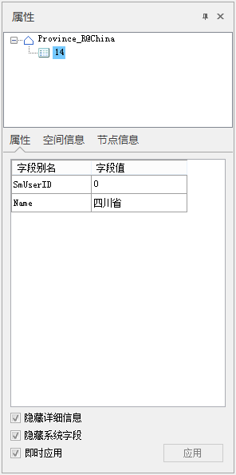

在数据集中选中几何对象和文本对象后，可通过右键菜单中的属性选项，查询和修改其属性。几何对象和文本对象的查询和修改方式有所不同，下文将分别进行介绍。

1. 在地图窗口中选中一个或多个几何/文本对象，单击鼠标右键并选择 **属性** 命令。
2. 弹出的 **属性** 命窗口，窗口中显示了选中对象的详细信息，包括属性信息、空间信息和构成对象的节点信息，若选中的对象为文本对象，则属性窗口中还会有文本信息。
3. 若选中多个对象，属性面板上方的树结点会显示当前地图窗口中的所有选中对象，可选中不同的对象的树节点，切换查看其属性信息。用户可以在弹出的属性表窗口中，对多个对象的属性进行批量设置和修改。  

  
---  
地图与属性窗口  

###  属性窗口介绍

**属性** 窗口的上侧为一个树状结构的目录，显示了当前地图窗口中选中的所有对象；窗口下方显示了选中对象的不同类别的属性信息，包括 **属性信息** 、
**空间信息** 、 **节点信息** ，若选中的为文本对象，则属性面板中还会有 **文本** 信息。下面详细介绍各类信息的具体内容：

* #### 属性信息

属性信息显示该对象所有的属性字段属性信息，即该对象对应属性表中的记录的字段信息，包括字段名称、字段别名、字段的类型、字段值以及字段是否为必填字段。

* **隐藏系统字段属性：** 该复选框用于设置是否在几何对象的属性窗口中显示或隐藏系统字段的属性信息。勾选该复选框，则隐藏所有系统字段的属性信息，避免由于系统字段太多时无法清楚查看非系统字段的属性信息。
* **隐藏详细信息：** 该复选框用于设置是否在几何对象的属性窗口中显示或隐藏详细信息字段。详细信息字段包括字段名称、字段类型等信息。勾选该复选框，则隐藏其它字段的属性信息，仅显示字段别名和字段值两个字段。
* #### 空间信息

用于显示选中对象的空间信息，包括类型、长度、外接矩形等信息。

* **基本信息**

**对象类型：** 显示对象的类型信息，即对象是点对象、线对象、面对象还是其他类型的对象。

**长度：** 显示线对象的长度。

**周长：** 显示面对象的周长。

**面积：** 显示面对象的面。

* **外接矩形**

上、下、左、右，用来显示对象的空间范围信息，其中，上、下的值为沿 Y 轴方向（即‘Y=’）的两个边界，；左、右的值为沿 X
轴（即‘X=’）方向的两个边界，数值的单位与选中对象所在的数据集的坐标单位相同。

* #### 节点信息

用于显示选中对象的节点信息，即构成对象的节点的相关信息，主要以表格的形式显示。

* **对象信息：**

**对象类型：** 显示对象的类型信息，即对象是点对象、线对象、面对象还是其他类型的对象。

**子对象总数：** 显示构成选中对象的子对象的数目。简单对象为1个子对象，复合对象可能包含2个或者多个子对象。

**当前子对象：**
其右侧的组合框的下拉列表列出了构成选中对象的所有子对象，选中下拉列表中任意一项，下方的表格将显示所选择的子对象的节点的信息（坐标信息）。

**总节点数：** 构成选中对象的所有的节点总数（包括所有子对象）。

**位置：** 显示了当前选中对象的中心点位置。

* **节点信息：**
该表格区域显示当前子对象的节点信息，每条记录对应子对象的一个节点，信息内容为节点的坐标信息，坐标单位与选中对象所在的数据集的坐标单位相同。

仅当选中的对象所在的图层为可编辑图层，可以通过添加节点、插入节点以及删除节点的方式修改对象节点的坐标信息。

**添加节点：** 为当前子对象的最后一个节点，添加一个新的节点。默认的 X 坐标和 Y 坐标为（0，0）。此按钮仅在选中对象所在图层为可编辑图层时才可用。

**插入节点：** 在当前选中节点处（十字标记所在的行）插入新的节点，新节点的 X 坐标值和 Y 坐标值
可以在列表框下面的文本框中输入。此按钮仅在选中对象所在图层为可编辑图层、并且列表框中有选中节点时才可用。

**删除节点：**
删除列表框中选中的节点。此按钮仅在选中对象所在图层为可编辑图层、并且列表框中有选中节点时才可用。当列表框中未选中的节点数少于对象的控制点数（即线对象的未选中节点数少于2个，或者面对象的未选中节点数少于3个）时，此按钮不可用。

用户在修改过程中，如果不想保留对节点坐标的修改，可以使用“重置”按钮，对当前选中的子对象所有节点坐标值进行重置。

用户修改完坐标值后，单击右下角的“应用”按钮，即可应用所作的修改。

* #### 文本信息

若地图窗口中选中的为文本对象，则属性面板中会显示 **文本** 选项卡，主要用来显示和设置文本对象的文本风格。用户所设置的文本风格可在地图窗口中及时预览。

* **文本对象：**

**子对象** ：用来设置当前显示的文本对象中的子对象。

**文本内容** ：显示和设置当前文本子对象的文本内容。

**旋转角度** ：用来设置文本对象的旋转角度，若勾选了 **应用于当前子对象** 复选框，设置的角度将对当前文本的所有子对象生效。

* **文本属性：**

**字体名称**
：显示的字体。用于设置和设置文本对象所使用的字体，该标签控件右侧的组合框下拉列表中提供了丰富的字体供用户选择，同时提供了“最近使用的字体”分组，方便选择最近使用的字体名称。系统支持键盘快速首字母定位字体。例如在键盘上单击字母“T”，则在下拉列表框内会显示以字母"T"开头的字体。单击该标签控件右侧的组合框下拉列表，选择一种字体。

**字号** ：显示和设置文本对象的字体大小。用户既可以输入字体大小的数值，也可以从右侧的组合框下拉列表中选择合适的字体大小。

有关对齐方式的更多内容，请参见[文本对齐方式说明](TextAlignDirection)。

**字高** ：显示和设置文本对象字体的高度。

**字宽** ：显示和设置文本对象字体的宽度。

**背景颜色**：用来设置文本对象的背景颜色或者轮廓颜色。单击右侧的颜色按钮，用户可在弹出颜色面板选择和设置合适的颜色，也可单击颜色面板底部的“其它色彩…”按钮，在弹出的“颜色”对话框中自定义所需的颜色。

**文本颜色**：用来设置文本对象的文字颜色。单击右侧的颜色按钮，用户可在弹出颜色面板选择和设置合适的颜色，也可单击颜色面板底部的“其它色彩…”按钮，在弹出的“颜色”对话框中自定义所需的文字颜色。

* **字体效果：**

勾选相应的字体效果复选框，即可应用这种字体效果。

**加粗** ：用来控制文本对象的字体是否使用粗体。

**删除线**：用控制来文本对象的文本是否有删除线修饰。

**左斜体/右斜体** ：用来控制文本对象的字体左斜或者右斜。

**下划线** ：用来控制文本对象的文本是否有下划线修饰。

**阴影** ：用来控制文本对象的文本是否有阴影修饰。

**轮廓** ：用来控制文本对象的文本是否有轮廓修饰。

**固定大小**
：用来控制文本对象是否固定大小，如果勾选该复选框，表示文字大小不随地图的缩放而改变大小；如果该复选框为非选中状态，表示文字大小随地图的缩放而缩放。

**背景透明** ：用来控制文本对象的背景是否透明。

**对齐方式**
：显示和设置文本对象中文本的对齐方式。系统提供了12种文字对齐方式：左上角、中上点、右上角、左基线、中心基线、右基线、左下角、中下点、右下角、左中点、中心、右中点。单击该按钮，用户可在下拉列表中选择所需的文字对齐方式。

