SuperMap 应用程序提供了12种文本对齐方式：左上角、中上点、右上角、左基线、中心基线、右基线、左下角、中下点、右下角、左中点、中心、右中点。

对齐方式是指以锚点为对齐起始点进行向外的对齐，即锚点是对齐基点。在对齐方式发生变化时，锚点位置不变，文本对象根据不同的对齐方式以锚点为对齐起始点移动。

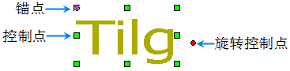|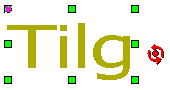|  
---|---|---  
如果文本对象对齐方式为左上角，选中该文本对象后，会发现其锚点位于文本对象的左上角，旋转点位于文本对象的右侧附近。|鼠标移至旋转点上，旋转点发生变化。|选中旋转点，按住左键不放（会发现旋转点再次发生变化），在地图上进行旋转操作，会发现在此所做的旋转操作是以锚点为旋转基点的。  
  
在12种对齐方式中有3种基线对齐方式。 **基线** 主要是针对英文字符而言，是指在使用三线格英文写作时的第二条线，例如小写英文字母
abcde，全部的大写英文字母均位于基线上，而小写字母 gypj 有部分位于基线下。下表左基线、右基线和中心基线图示中的辅助线位置就是基线。

12种对齐方式及其锚点图示见下表，下表图中的的直线为辅助线，无实际意义。辅助线和锚点的位置一直没有变化，文本对象根据对齐方式的改变而移动。

说明|图示|说明|图示|说明|图示  
---|---|---|---|---|---  
**左上角：** 以文本对象的上水平线与左垂直线交叉点为锚点的对齐方式。|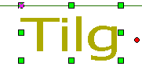| **上中点：** 以文本对象的上水平线与中心垂直线交叉点为锚点的对齐方式。 |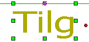| **右上点：** 以文本对象的上水平线与右垂直线交叉点为锚点的对齐方式。|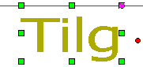   
**左中点：** 以文本对象的中心水平线与左垂直线交叉点为锚点的对齐方式。|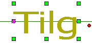| **中心：** 以文本对象的中心水平线与中心垂直线交叉点为锚点的对齐方式。|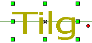| **右中点：** 以文本对象的中心水平线与右垂直线交叉点为锚点的对齐方式。|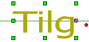  
**左基线：** 以文本对象的基线与左垂直线交叉点为锚点的对齐方式。|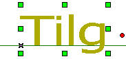| **中心基线：** 以文本对象的基线与中心垂直线交叉点为锚点的对齐方式。|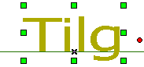| **右基线：** 以文本对象的基线与右垂直线交叉点为锚点的对齐方式。|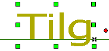  
**左下角：** 以文本对象的下水平线与左垂直线交叉点为锚点的对齐方式。|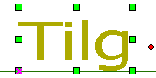| **中下点：** 以文本对象的下水平线与中心垂直线交叉点为锚点的对齐方式。 |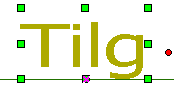| **右下点：** 以文本对象的下水平线与右垂直线交叉点为锚点的对齐方式。|  
  
上表中可以发现，除基线对齐外，其他9种对齐方式中锚点、旋转基点和相应的一个控制点重合。

上表中，涉及的文本对象的上水平线、中心水平线、下水平线和左垂线、中心垂线、右垂线不是指地图窗口的普通水平线和垂线，而是指文本对象相对位置的水平线和垂线，它们会跟着文本对象的位置变化而变化，例如文本对象的移动和旋转时，它们也会跟文本对象的相对位置而发生移动和选择（见下表）。

|  
---|---  
图中文本对象的水平线和垂直线与地图的水平线和垂直线重合。| 文本对象旋转后，文本对象的水平线和垂直线也进行了相同的旋转，而地图的水平线和垂直线没有发生变化。

