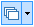
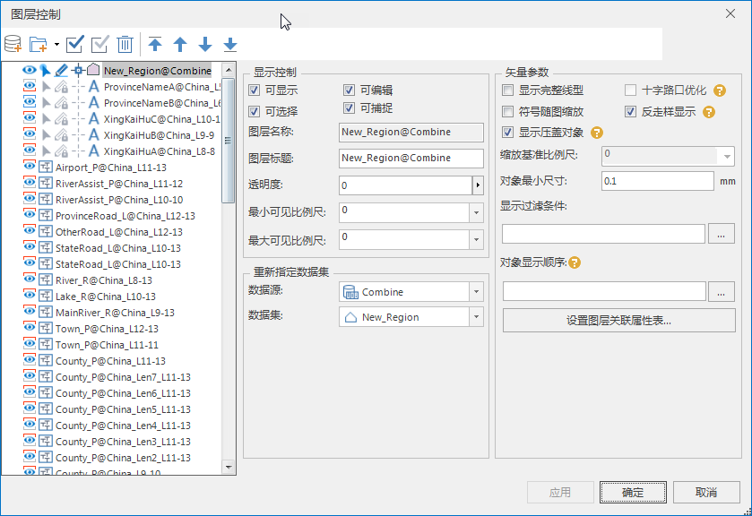

---
id: LayerControl
title: 图层控制
---  

图层包括点图层、线图层、面图层、文本图层、栅格/影像图层、专题图图层、图层分组等。所有图层都在图层管理器中叠加显示。可通过图层管理器中“图层控制”下拉按钮中的按钮中的“
**图层控制** ”和“ **图层节点可拖拽** ”，对地图图层进行控制。

* **图层节点可拖拽** ：单击下拉按钮，通过“图层节点可拖拽”设置图层节点是否可拖拽，用户可固定图层管理器中图层顺序，防止图层过多时拖拽导致的误操作。
* **图层控制** ：单击按钮，弹出“图层控制”对话框，图层控制用来对地图窗口中的单个图层或者多个图层的状态和属性进行控制。图层控制是通过“图层控制”对话框来实现的。“图层控制”对话框显示了当前地图窗口中的所有图层以及每个图层的状态和属性。用户可以修改图层的状态，是否可显示、可选择、可编辑、可捕捉、符号是否随图缩放，比例尺等以及其他显示风格，调整图层顺序，添加或者移除图层等。

“图层控制”对话框由工具栏、图层列表和功能设置区三部分组成，如下图所示：

  

  * **工具栏**

提供了添加图层、移除图层、全选图层、反选图层等常用工具，同时还提供了置顶、上移、下移、置底等工具，用来调整图层的显示顺序。

  * **图层列表**

列出了当前地图窗口中的所有图层以及显示顺序。结合工具栏中置顶、上移、下移、置底工具使用，可以调整图层在列表中的顺序。

  * **功能设置区**

针对不同的数据类型，功能设置区提供相应的操作，帮助用户对图层的状态和属性进行控制。当复选框状态为保留状态时，表示保留原来的设置状态，例如原来的状态为选择状态，则当前状态仍为选择状态。

下面就不同数据类型图层对应的图层控制功能进行详细说明。

 [选中单个矢量图层](SingleLayerVector)

 [选中多个矢量图层](MutiLayerVector)

 [选中单个影像图层](SingleLayerImage)

 [选中单个栅格图层](SingleLayerRaster)

 [选中多个栅格/影像图层](MutiLayerRaster)

 [同时选中矢量和栅格图层](MutiLayerVectorRaster)

 [选中单个专题图图层](SingleLayerThematic)

 [选中单个图层分组](SingleLayerGroup)

