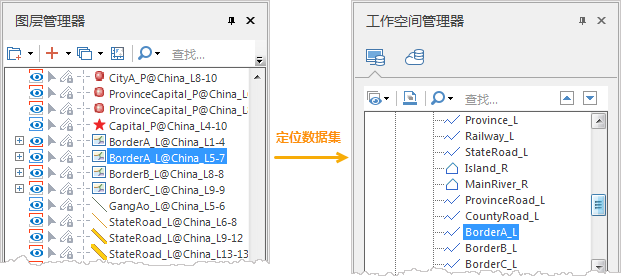

### 从地图中移除图层

“删除”命令，用来将该图层管理器中的图层从当前地图中移除。

**功能入口**

* 右键点击选中图层管理器中的图层结点，在弹出右键菜单中选择“删除”命令。
* 在图层管理器中选中图层，按 Delete 键也可以移除图层。

### 重命名图层

“重命名”命令，用来修改矢量图层的标题。

**功能入口**

* 右键点击选中图层管理器中的矢量图层结点，在弹出右键菜单中选择“重命名”命令。此时，选中的矢量图层结点的显示名称变为可编辑状态，用户可以输入新的名称来修改图层的标题。
* 在图层管理器中选中图层，按 F2 键也可以实现图层重命名。 

修改名称后，在图层管理器中任意位置单击鼠标，选中的矢量图层结点的显示名称变为不可编辑状态。

注意事项

* 图层既有名称，又有标题。这两个属性比较相似，但其作用是不同的。
* 图层名称是图层在地图中的唯一标识,是系统自动生成的，不可修改，其格式是:数据集名@数据源别名，如Continent@world#1。
* 图层标题是图层在图例中的显示名称,默认情况下，图层的标题与名称相同，但标题可以修改为有意义的标题，如世界大洲。

### 图层复制粘贴

在配制地图时，可对地图中的图层进行复制，并将复制的图层粘贴到当前地图或其他地图中。粘贴的图层会保留原图层的风格和图层属性，可重复使用配制好的图层风格，提高制图效率。具体说明如下：

* 支持跨地图进行复制粘贴；
* 支持跨工作空间进行复制粘贴；
* 支持复制粘贴普通图层和专题图图层；
* 图层的复制粘贴支持 **Ctrl+C** 、 **Ctrl+V** 键盘操作，也支持鼠标右键的“ **复制** ”和“ **插入复制的图层** ”操作；
* 粘贴图层时，可将复制的图层粘贴到图层管理器中选中图层的上方。

### 图层定位数据集

SuperMap 桌面支持定位选中图层所关联的数据集，当用户地图中图层较多时，可使用该功能，快速定位到相关联的数据集。

**功能入口**

在图层管理器中，选中需定位数据集的图层，在右键菜单中选择 **定位数据集** 选项， **工作空间管理器** 即可高亮显示与图层关联的数据集。

  
---  

###  使用快照图层

快照图层是一种特殊的图层组，快照图层分组中的图层都为地图的一个快照图层。快照图层的绘制方式比较特殊，只在第一次显示时进行绘制，此后浏览地图时，如果地图显示范围未发生变化，快照图层将不会重新绘制，也就是快照图层不随地图刷新而重新绘制；如果地图显示范围发生变化，将自动触发快照图层的刷新绘制。快照图层是提高地图显示性能的方式之一。

由于快照图层是特殊的图层分组，快照图层中可以添加分组图层对象（LayerGroup），但是快照图层中不可以再添加快照图层，并且分组图层对象（LayerGroup对象）中也不可以添加快照图层。

**应用场景**
：配图过程中，有的图层数据量较大，会影响地图的刷新效率，此时，可将刷新频率低、数据量较大，必须显示的图层添加到快照图层中，在不改变地图窗口显示范围的情况下，快照图层分组中的图层将不会刷新，提高了地图的显示的性能。

**创建快照图层分组**

1. 在图层管理器的空白区域中，单击鼠标右键，选择“新建快照图层”选项，即可创建一个快照图层分组。
2. 选中一个或多个图层，将其移动至快照图层分组中，这些图层即可作为快照图层，地图窗口范围不变的情况下，不刷新快照图层分组下的图层。

