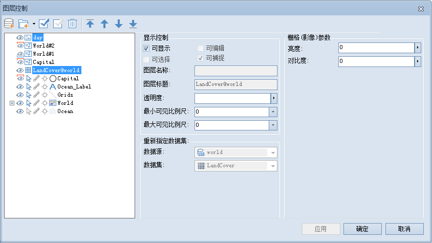

在图层列表中，同时选中栅格/影像图层时，用户可以对以下内容进行设置，如下图所示：

  

  * **可显示**

"可显示"用来控制选中的栅格/影像图层的可见性。勾选“可显示”前面的复选框，表示选中的图层可见；否则不可见。

  * **透明度**

透明度用于设置选中的图层的透明度。在右侧的文本框中输入透明度数值或者点击右侧的下拉箭头，在弹出透明度设置滑块中拖动滑块调整图层的透明度。透明度的数值范围为0至100之间的整数。0
代表不透明，100 代表完全透明。

  * **最小可见比例尺**

设置选中的图层的最小可见比例尺。在右侧的文本框中输入需要设置的比例尺数值即可，如1：500000，或单击下拉按钮选择相应比例尺进行设置。图层设置最小可见比例尺后，若地图的比例尺小于选中的图层所设置的最小可见比例尺时，选中的图层将不可见。默认值为1：0，表示对该图层不设置最小可见比例尺。

  * **最大可见比例尺**

设置选中的图层的最大可见比例尺。在右侧的文本框中输入需要设置的比例尺数值即可，如1：100000，或单击下拉按钮选择相应比例尺进行设置。图层设置最大可见比例尺后，若地图的比例尺大于选中的图层所设置的最大可见比例尺时，选中的图层将不可见。默认值为1：0，表示对该图层不设置最大可见比例尺。

  * **亮度**

用来调整影像图层的明暗程度。在右侧的文本框中输入亮度值或者点击右侧的下拉箭头，在弹出亮度设置滑块中拖动滑块调整图层的亮度。亮度的数值范围为-100至100之间的整数。若输入的数值大于100，则默认亮度值为100；若输入的数值小于-100，则默认亮度值为-100。

  * **对比度**

用来调整影像图层的对比度。在右侧的文本框中输入对比度数值或者点击右侧的下拉箭头，在弹出对比度设置滑块中拖动滑块调整图层的对比度。对比度的数值范围为-100至100之间的整数。若输入的数值大于100，则默认对比度值为100；若输入的数值小于-100，则默认对比度值为-100。

### 相关主题

 [图层控制](LayerControl)

 [“栅格/影像”组](../VisualSetting/Rastergroup)

