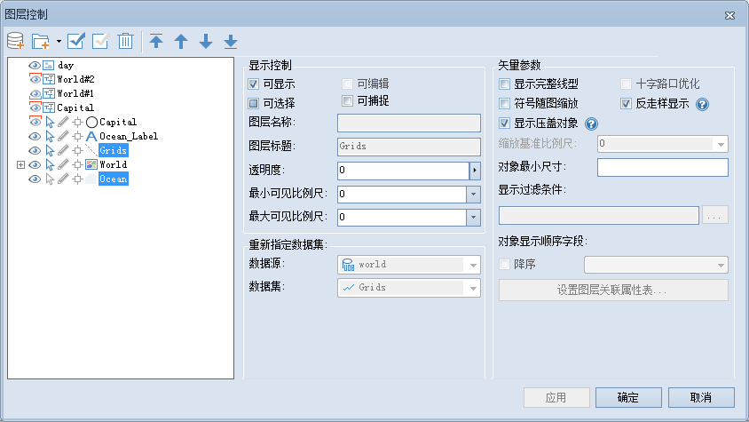

在图层列表中，选中多个矢量图层时，用户可以对以下内容进行设置，如下图所示：

  
---  
图：选中多个矢量图层  
  
  * **可显示**

"可显示"用来控制选中的矢量图层的可见性。勾选“可显示”前面的复选框，表示选中的图层可见；否则不可见。

如果取消勾选“可显示”，则“可选择”、“可编辑”、“可捕捉”设置项均不可用。

  * **可选择**

“可选择”用来控制选中的图层是否可以选择，即图层中的对象能否被选中。勾选“可选择”前面的复选框，表示选中的图层可选择，即图层中的对象可选择；否则不可选择。

  * **可编辑**

“可编辑”用来控制选中的图层是否可编辑，即图层中的对象是否可以被编辑。点击“可编辑”前面的复选框，表示选中的图层可编辑，即图层中的对象可编辑；否则不可编辑。

当前地图窗口处于单个图层编辑状态时，“可编辑”前的复选框为保留状态，表示保留选中的各个图层的编辑状态
，维持原状；当前地图窗口使用多图层编辑时，可以使用“可编辑”前的复选框对选中的多个图层的可编辑状态统一进行设置。勾选时该项，则选中的图层都可以编辑；取消勾选该项，则选中的图层都不能编辑。

有关多图层编辑的内容，请参见：[
多图层编辑](../../DataProcessing/Objects/EditObjects/MultiLayerEditSet)。

  * **可捕捉**

“可捕捉”用来控制选中的图层是否可以捕捉，即在矢量图层中进行选择、编辑等操作时，是否可以捕捉到选中的图层中的对象。

  * **透明度**

透明度用于设置选中的图层的透明度。在右侧的文本框中输入透明度数值或者点击右侧的箭头符号，在弹出透明度设置滑块中拖动滑块调整图层的透明度。透明度的数值范围为
0 至 100 之间的整数。0 代表不透明，100 代表完全透明。

  * **最小可见比例尺**

设置选中的图层的最小可见比例尺。在右侧的文本框中输入需要设置的比例尺数值即可，如1：500000，或单击下拉按钮选择相应比例尺进行设置。图层设置最小可见比例尺后，若地图的比例尺小于选中的图层所设置的最小可见比例尺时，选中的图层将不可见。默认值为1：0，表示对该图层不设置最小可见比例尺。

  * **最大可见比例尺**

设置选中的图层的最大可见比例尺。在右侧的文本框中输入需要设置的比例尺数值即可，如1：100000，或单击下拉按钮选择相应比例尺进行设置。图层设置最大可见比例尺后，若地图的比例尺大于选中的图层所设置的最大可见比例尺时，选中的图层将不可见。默认值为1：0，表示对该图层不设置最大可见比例尺。

  * **显示完整线型**

用来设置线对象的符号是否完整显示。线对象包括线图层的线对象以及面图层的边界。如果线的长度小于线符号周期长度，或者线长度不够线符号周期长度的整数倍时，不足线符号的周期的那部分线就不能完全显示。勾选显示完整线型后，会对线符号进行处理，使该符号完整显示出来，最终达到优化线符号的显示效果。

更多有关显示完整线型的内容，请参见：[ 显示完整线型](../AdvanceSetting/Linedisplay)。

  * **符号随图缩放**

显示/设置被选图层中的符号(包括点状符号和线型)是否可以随图层的缩放而缩放。该功能对于各类专题图图层不适用。

  * **十字路口优化**

仅在同时选中多个线图层时，该功能可用。设置线图层是否使用十字路口优化效果。适用于图层风格为双线线型的线图层和网络线图层。更多有关十字路口优化的内容，请参见：[启用十字路口优化](../AdvanceSetting/RoadCross)。

  * **反走样显示**

用于减少或消除图层信息失真的现象，优化图层显示效果。反走样需要同时开启地图反走样和图层反走样才可生效，“地图反走样”操作请参见：[地图显示优化](../../Optimization/MapOptimization/MapOptimization#1)。

  * **显示压盖对象**

用于控制是否显示产生压盖现象的对象，若勾选该复选框，发生压盖现象的所有对象都会显示，需同时勾选“地图属性”面板中“显示压盖对象”复选框，图层显示压盖对象效果才生效，还可在压盖设置中进行详细设置，具体内容请参阅[压盖设置](../../Optimization/MapOptimization/OverlaySetting)。

  * **对象最小尺寸（毫米）**

设置选中的图层对象显示的最小尺寸。在右侧的文本框中输入数值即可，单位为毫米。当前地图放大或缩小时，若该图层中任意一个几何对象的最小外接矩形的宽度和高度之中的较大值小于此设置值时，则该几何对象不可见。当选中点图层时，此项设置失效。

###  相关主题

 [图层控制](LayerControl)

 [选中单个矢量图层](SingleLayerVector)

