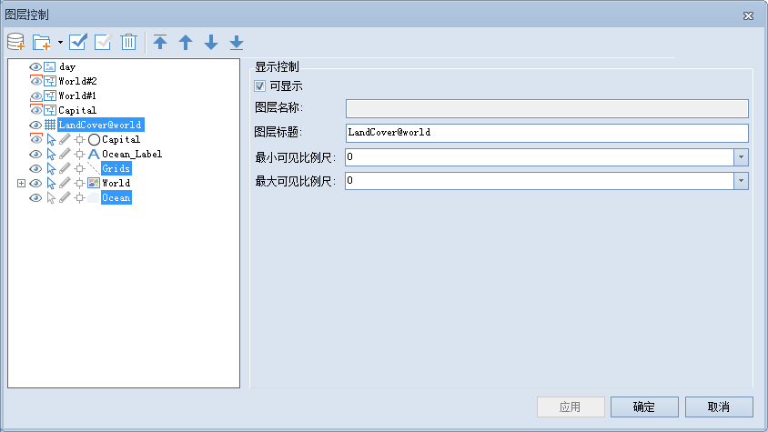

在图层列表中，选中多个矢量和栅格图层时，用户可以对以下内容进行设置，如下图所示：

  

  
  * **可显示**

"可显示"用来控制选中的矢量图层的可见性。勾选“可显示”前面的复选框，表示选中的图层可见；否则不可见。

如果取消勾选“可显示”，则其他的设置项均不可用。

  * **透明度**

透明度用于设置选中的图层的透明度。在右侧的文本框中输入透明度数值或者点击右侧的箭头符号，在弹出透明度设置滑块中拖动滑块调整图层的透明度。透明度的数值范围为
0 至 100 之间的整数。0 代表不透明，100 代表完全透明。

  * **最小可见比例尺**

设置选中的图层的最小可见比例尺。在右侧的文本框中输入需要设置的比例尺数值即可，如1：500000，或单击下拉按钮选择相应比例尺进行设置。图层设置最小可见比例尺后，若地图的比例尺小于选中的图层所设置的最小可见比例尺时，选中的图层将不可见。默认值为1：0，表示对该图层不设置最小可见比例尺。

  * **最大可见比例尺**

设置选中的图层的最大可见比例尺。在右侧的文本框中输入需要设置的比例尺数值即可，如1：100000，或单击下拉按钮选择相应比例尺进行设置。图层设置最大可见比例尺后，若地图的比例尺大于选中的图层所设置的最大可见比例尺时，选中的图层将不可见。默认值为1：0，表示对该图层不设置最大可见比例尺。

### 相关主题

 [图层控制](LayerControl)

 [选中单个矢量图层](SingleLayerVector)

 [选中多个矢量图层](MutiLayerVector)

 [选中单个影像图层](SingleLayerImage)

 [选中单个栅格图层](SingleLayerRaster)

 [选中多个影像/影像图层](MutiLayerRaster)

 [选中单个专题图图层](SingleLayerThematic)

