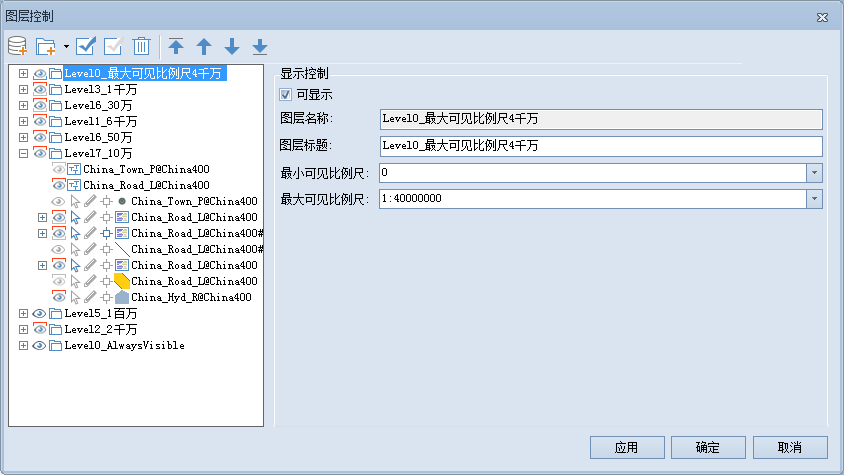

在图层列表中，选选中单个图层分组时，用户可以对以下内容进行设置，如下图所示：

  
 
  
  * **可显示**

"可显示"用来控制选中的图层分组中所有图层的可见性。勾选“可显示”前面的复选框，表示选中的图层分组中所有图层可见；否则不可见。

  * **图层名称**

用来显示选中图层分组的名称。不可对图层分组名称进行修改，图层分组的名称在分组所在的地图中唯一标识此图层分组。

  * **图层标题**

右侧的文本框用来显示选中图层分组的标题。可以对图层分组标题进行修改，修改后该图层分组在图层管理器中的显示名称发生变化，但是图层分组的名称不会随之改变。

  * **最小可见比例尺**

设置选中的图层的最小可见比例尺。在右侧的文本框中输入需要设置的比例尺数值即可，如1：500000，或单击下拉按钮选择相应比例尺进行设置。图层设置最小可见比例尺后，若地图的比例尺小于选中的图层所设置的最小可见比例尺时，选中的图层将不可见。默认值为1：0，表示对该图层不设置最小可见比例尺。

  * **最大可见比例尺**

设置选中的图层的最大可见比例尺。在右侧的文本框中输入需要设置的比例尺数值即可，如1：100000，或单击下拉按钮选择相应比例尺进行设置。图层设置最大可见比例尺后，若地图的比例尺大于选中的图层所设置的最大可见比例尺时，选中的图层将不可见。默认值为1：0，表示对该图层不设置最大可见比例尺。

###  相关主题

 [图层控制](LayerControl.htm)

 [选中单个矢量图层](SingleLayerVector.htm)

 [选中多个矢量图层](MutiLayerVector.htm)

 [选中单个影像图层](SingleLayerImage.htm)

 [选中单个栅格图层](SingleLayerRaster.htm)

 [选中多个影像/影像图层](MutiLayerRaster.htm)

 [同时选中矢量和栅格图层](MutiLayerVectorRaster.htm)

 [选中单个专题图图层](SingleLayerThematic.htm)

