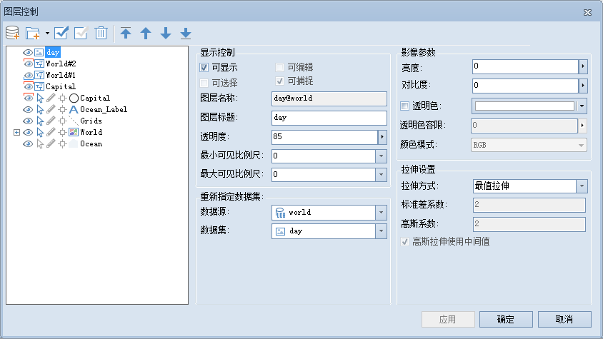

在图层列表中，选中单个影像图层时，用户可以对以下内容进行设置，如下图所示：

  

  
  * **可显示**

"可显示"用来控制选中图层的可见性。勾选“可显示”前面的复选框，表示选中的图层可见；否则不可见。

  * **图层名称**

“图层名称”右侧的文本框用来显示该图层的图层名称。不可对图层名称进行修改，图层的名称在图层所在的地图中唯一标识此图层。

  * **图层标题**

“图层标题”右侧的文本框用来显示该图层的图层标题。可以对图层标题进行修改，修改后该图层在图层管理器中的显示名称发生变化，但是空间管理器中对应的数据集的名称不会发生改变。

  * **透明度**

透明度用于设置选中的图层的透明度。在右侧的文本框中输入透明度数值或者点击右侧的下拉箭头，在弹出透明度设置滑块中拖动滑块调整图层的透明度。透明度的数值范围为
0 至 100 之间的整数。0 代表不透明，100 代表完全透明。

  * **最小可见比例尺**

设置选中的图层的最小可见比例尺。在右侧的文本框中输入需要设置的比例尺数值即可，如1：500000，或单击下拉按钮选择相应比例尺进行设置。图层设置最小可见比例尺后，若地图的比例尺小于选中的图层所设置的最小可见比例尺时，选中的图层将不可见。默认值为1：0，表示对该图层不设置最小可见比例尺。

  * **最大可见比例尺**

设置选中的图层的最大可见比例尺。在右侧的文本框中输入需要设置的比例尺数值即可，如1：100000，或单击下拉按钮选择相应比例尺进行设置。图层设置最大可见比例尺后，若地图的比例尺大于选中的图层所设置的最大可见比例尺时，选中的图层将不可见。默认值为1：0，表示对该图层不设置最大可见比例尺。

  * **重新指定数据集**

单击文本框右侧的的按钮 ，在弹出的“重新指定数据集”对话框，可以为该图层重新指定新的引用数据集。分别点击“数据源”和“数据集”右侧的下拉箭头，选择要引用的数据集以及该数据集所在的数据源。更多内容请参见：[重新指定数据集](DTv2_BindDataNew)。

  * **亮度**

用来调整影像图层的明暗程度。在右侧的文本框中输入亮度值或者点击右侧的下拉箭头，在弹出亮度设置滑块中拖动滑块调整图层的亮度。亮度的数值范围为 -100 至
100 之间的整数。若输入的数值大于100，则默认亮度值为100；若输入的数值小于-100，则默认亮度值为-100。

  * **对比度**

用来调整影像图层的对比度。在右侧的文本框中输入对比度数值或者点击右侧的下拉箭头，在弹出对比度设置滑块中拖动滑块调整图层的对比度。对比度的数值范围为 -100
至 100 之间的整数。若输入的数值大于100，则默认对比度值为100；若输入的数值小于-100，则默认对比度值为-100。

  * **颜色模式**

设置多波段影像显示的色彩模式及每个波段对应的颜色通道，以得到彩色合成效果。点击“颜色模式”右侧的下拉箭头，在弹出的颜色模式列表中选择一种颜色模式即可。
  
更多有关颜色模式的内容，请参见： [颜色模式](../VisualSetting/ColorMode)和
[多波段显示设置](../VisualSetting/DTi2_MultiBandsViewe)。

  * **透明色**

透明色用来将影像图层中某种颜色设置为透明色，即将影像中指定颜色的像元透明显示。勾选“透明色”前面的复选框即可启用透明效果，点击右侧的下拉箭头，在弹出的颜色面板中选择一种颜色即可，同时透明色容限工具可用。

  * **透明色容限**

用户可使用滑块来调整透明色容限值，或者直接输入数值，透明色容限的取值范围为 0-255之间的整数。

  * **拉伸方式**

目前，SuperMap桌面应用程序提供四种影像拉伸方式：无拉伸、最值拉伸、标准差拉伸和高斯拉伸。

  * **标准差拉伸系数**

仅当拉伸方式为标准差拉伸时，此参数可用。标准差拉伸系数确定了标准差的取值范围。假设标准差范围为[a,b]，标准差拉伸系数为
n，则进行标准差拉伸时，标准差的取值范围为[an,bn]。应用程序默认的标准差拉伸系数为2，即默认使用2倍标准差进行拉伸。

  * **高斯拉伸系数**

仅当拉伸方式为高斯拉伸时，此参数可用。假设影像数据像元值范围为[a,b]，高斯拉伸系数为n，则进行高斯拉伸时，保持中心轴不变，将像元值进行n倍拉伸，最后以[0，255]的范围显示。应用程序默认的高斯拉伸系数为2。

###  相关主题

 [图层控制](LayerControl)

 [“栅格/影像”组](../VisualSetting/Rastergroup)

