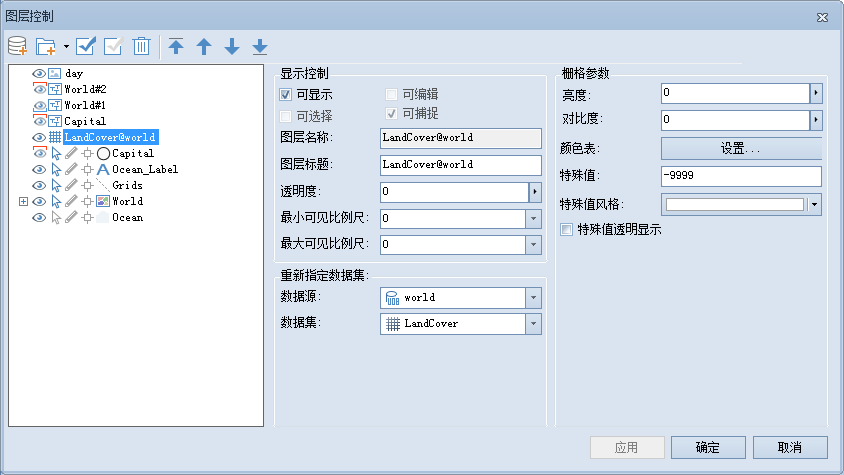

在图层列表中，选中单个栅格图层时，用户可以对以下内容进行设置，如下图所示：

  

  
  * **可显示**

"可显示"用来控制选中图层的可见性。勾选“可显示”前面的复选框，表示选中的图层可见；否则不可见。

  * **图层名称**

“图层名称”右侧的文本框用来显示该图层的图层名称。不可对图层名称进行修改，图层的名称在图层所在的地图中唯一标识此图层。

  * **图层标题**

“图层标题”右侧的文本框用来显示该图层的图层标题。可以对图层标题进行修改，修改后该图层在图层管理器中的显示名称发生变化，但是空间管理器中对应的数据集的名称不会发生改变。

  * **透明度**

透明度用于设置选中的图层的透明度。在右侧的文本框中输入透明度数值或者单击右侧的下拉箭头，在弹出透明度设置滑块中拖动滑块调整图层的透明度。透明度的数值范围为
0 至 100 之间的整数。0 代表不透明，100 代表完全透明。

  * **最小可见比例尺**

设置选中的图层的最小可见比例尺。在右侧的文本框中输入需要设置的比例尺数值即可，如1：500000，或单击下拉按钮选择相应比例尺进行设置。图层设置最小可见比例尺后，若地图的比例尺小于选中的图层所设置的最小可见比例尺时，选中的图层将不可见。默认值为1：0，表示对该图层不设置最小可见比例尺。

  * **最大可见比例尺**

设置选中的图层的最大可见比例尺。在右侧的文本框中输入需要设置的比例尺数值即可，如1：100000，或单击下拉按钮选择相应比例尺进行设置。图层设置最大可见比例尺后，若地图的比例尺大于选中的图层所设置的最大可见比例尺时，选中的图层将不可见。默认值为1：0，表示对该图层不设置最大可见比例尺。

  * **重新指定数据集**

单击文本框右侧的的按钮 ，在弹出的“重新指定数据集”对话框，可以为该图层重新指定新的引用数据集。分别单击“数据源”和“数据集”右侧的下拉箭头，选择要引用的数据集以及该数据集所在的数据源。更多内容请参见：[重新指定数据集](DTv2_BindDataNew)。

  * **亮度**

用来调整影像图层的明暗程度。在右侧的文本框中输入亮度值或者单击右侧的下拉箭头，在弹出亮度设置滑块中拖动滑块调整图层的亮度。亮度的数值范围为 -100 至
100 之间的整数。若输入的数值大于100，则默认亮度值为100；若输入的数值小于-100，则默认亮度值为-100。

  * **对比度**

用来调整影像图层的对比度。在右侧的文本框中输入对比度数值或者单击右侧的下拉箭头，在弹出对比度设置滑块中拖动滑块调整图层的对比度。对比度的数值范围为 -100
至 100 之间的整数。若输入的数值大于100，则默认对比度值为100；若输入的数值小于-100，则默认对比度值为-100。

  * **颜色表**

用来设置栅格图层中像元的显示颜色。单击“颜色表”右侧的按钮
，弹出“颜色表”对话框，在该对话框中设置颜色方案。关于如何设置颜色表，请参见：[“颜色表”按钮 ](../VisualSetting/ColorTableDia)。

  * **特殊值**

“特殊值”和“特殊值颜色”配合使用可以帮助用户对指定的某一特定栅格值的颜色进行设置。

“特殊值”右侧的文本框用来输入某一栅格值，即用户需要对某些特定值的栅格像元的显示效果进行设置。

  * **特殊值风格**

“特殊值风格”用来设置特殊栅格值的显示颜色。可单击右侧的下拉箭头，在弹出的颜色面板中选择某一种颜色，则该栅格值的像元将显示为指定的颜色。同时点击颜色面板中的“透明色”按钮可设置特殊栅格值颜色为透明。

###  相关主题

 [图层控制](LayerControl)

 [“栅格/影像”组](../VisualSetting/Rastergroup)

