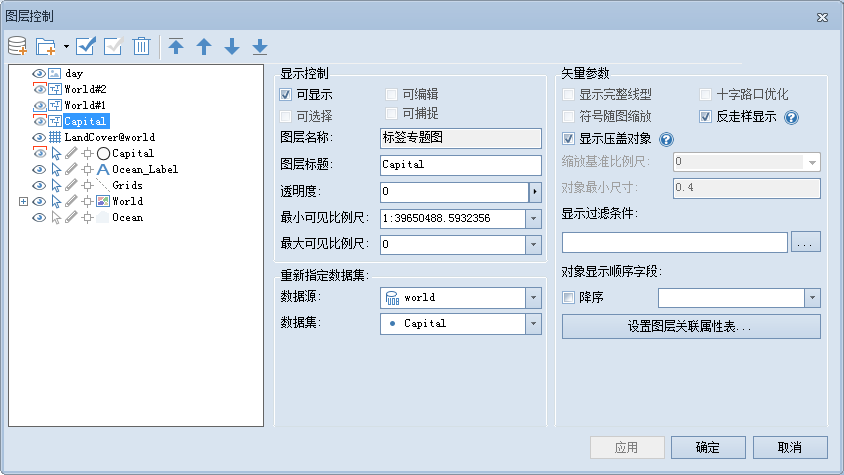

在图层列表中，选中一个专题图图层时，由于专题图内容的不同，可以设置的功能参数也不相同。选中标签专题图时，支持的情况如下图所示：

  

下面用一个表格详细说明各个专题图对不同功能参数的支持情况。

功能参数 | 单值 | 分段 | 标签 | 统计 | 等级符号 | 点密度 | 自定义 | 栅格单值 | 栅格分段  
---|---|---|---|---|---|---|---|---|---  
可显示 | √ | √ | √ | √ | √ | √ | √ | √ | √  
可选择 | √ | √ |  |  |  | √ | √ |  |  
可编辑 | √ | √ |  |  |  | √ | √ |  |  
可捕捉 | √ | √ |  |  |  | √ | √ |  |  
图层名称 | √ | √ | √ | √ | √ | √ | √ | √ | √  
图层标题 | √ | √ | √ | √ | √ | √ | √ | √ | √  
透明度 | √ | √ | √ | √ | √ | √ | √ | √ | √  
最小可见比例尺 | √ | √ | √ | √ | √ | √ | √ | √ | √  
最大可见比例尺 | √ | √ | √ | √ | √ | √ | √ | √ | √  
重新指定数据集 | √ | √ | √ | √ | √ | √ | √ | √ | √  
显示完整线型 | √ | √ |  |  |  | √ | √ |  |  
符号随图缩放 | √ | √ |  | √ | √ | √ | √ |  |  
十字路口优化 | √ | √ |  |  |  |  | √ |  |  
反走样显示 | √ | √ | √ | √ | √ | √ | √ |  |  
显示压盖对象 | √ | √ | √ | √ | √ | √ | √ |  |  
对象最小尺寸 | √ | √ |  | √ | √ | √ | √ |  |  
显示过滤条件 | √ | √ | √ | √ | √ | √ | √ |  |  
对象显示顺序字段 | √ | √ | √ | √ | √ | √ | √ |  |  
  
关于以上参数的具体说明，请参见[选中单个矢量图层](SingleLayerVector)页面的介绍。

### 注意事项

  * 标签专题图中，仅有矩阵标签专题图支持符号随图缩放和显示完整线型功能，其他三种标签专题图均不支持。
  * 在地图窗口中，同时选中多个专题图图层时，图层控制支持的功能会因为专题图类型的不同而不同。

### 相关主题

 [图层控制](LayerControl)

